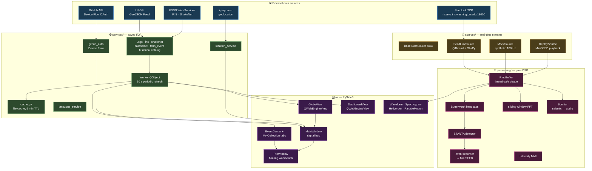
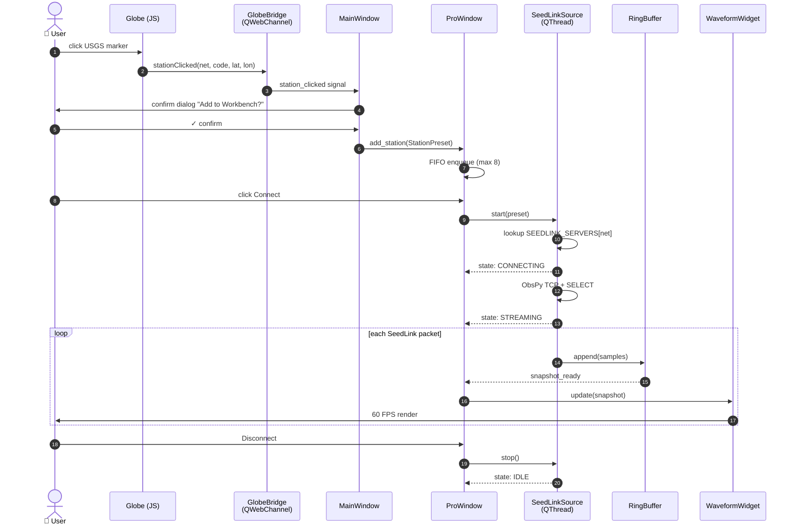
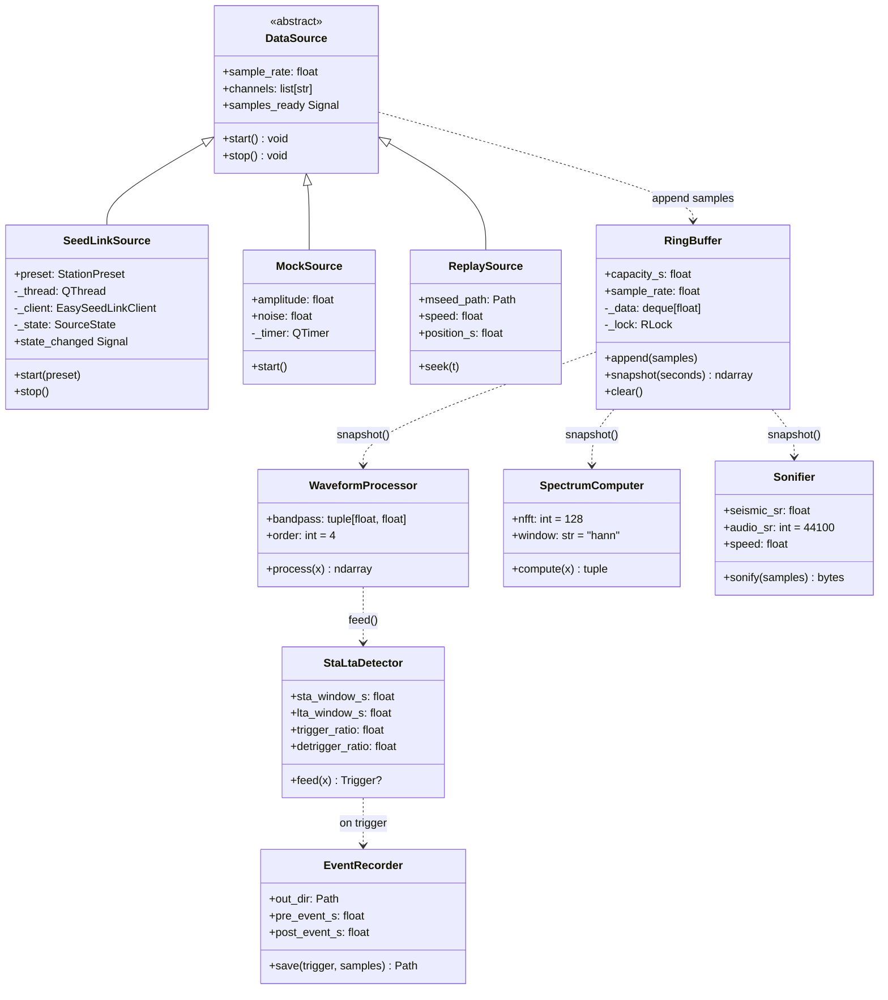
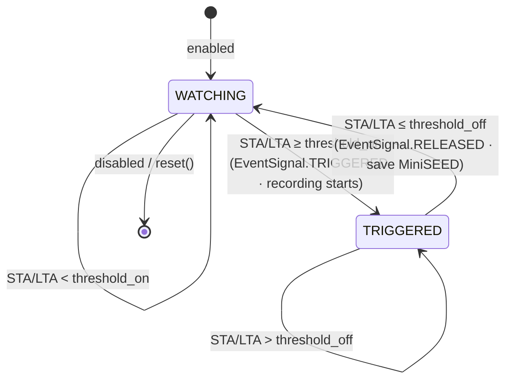

<div align="center">

# 🌐 SeismicGuard

[简体中文](README.md) · **English** · [Español](README.es.md) · [Français](README.fr.md)

> Formerly **ShakeVision OpenData Monitor**. **v0.8.3**'s headline upgrade is a
> **historical earthquake catalog + multilingual event search**: the Event Center
> gains a Live/Historical toggle that queries the full USGS **fdsnws-event** ANSS
> catalog (~1900→now), and search works across languages (type `日本` to find
> Japan; offline Flinn–Engdahl regions + localized country names). On top of that:
> the **Data panel** splits into **Live | Analysis** pages (Analysis runs
> **professional seismic statistics** on the historical catalog — GR/b-value,
> Mc/b over time, energy, spatial density, depth cross-section); **report export**
> comes in two mode-aware layouts (**monitoring / statistical**); time selection
> uses a **draggable range slider** and dropdowns auto-size across all languages.
> Earlier, **v0.8.0** reorganized the app
> around an *event → review → personal collection* flow and rewrites
> **Replay** into a professional waveform browser (zoom/pan, absolute UTC
> axis, band selection, instrument-response removal to VEL/DISP/ACC,
> ZNE→ZRT rotation, theoretical P/S arrivals via TauP, dB spectrogram, PSD,
> and PNG/CSV/QuakeML export). It adds a top-level **Event Center** (quake
> table + nearby stations) and a **"My Collection"** tab (favorite quakes/
> stations + recordings/review catalog, with reopening of saved reviews and
> "Open folder" export). Earlier, v0.7.0 shipped the SeismicGuard rebrand, a
> macOS-Sonoma-style theming overhaul, full 4-language i18n, an onboarding
> wizard, a Profile activity timeline, and IP-based location detection. The
> original v0.1.x binaries remain available on the Releases page under the
> legacy `ShakeVision-*` name.

**Open-source desktop seismic monitoring workstation**
*Cross-platform desktop seismic monitoring workbench*

Pulls real-time data from the global citizen seismic network
(Raspberry Shake) plus professional networks (USGS / IRIS), and fuses
a 3D globe · data dashboard · waveform / spectrogram / trigger
analysis into a single desktop app.

[](https://github.com/yiaogit/seismic-shakevision/actions/workflows/ci.yml)
[](https://github.com/yiaogit/seismic-shakevision/actions/workflows/release.yml)
[](LICENSE)
[](https://www.python.org/downloads/)
[](https://github.com/yiaogit/seismic-shakevision/releases/latest)
[](shakevision/i18n/locales/)

[**Download installers**](#-download) · [**Run from source**](#-run-from-source) · [**Features**](#-features) · [**Architecture**](#-architecture) · [**Release flow**](#-release-flow)

</div>

---

## ✨ Features

| Module                     | What it does                                                                                                                       |
|----------------------------|------------------------------------------------------------------------------------------------------------------------------------|
| 🌍 **3D Globe**            | ECharts-GL real-time Earth rendering, 600+ Raspberry Shake citizen stations + 400+ USGS / IRIS backbone stations, magnitude-coloured quakes, click-to-zoom + add to Pro workbench |
| 📊 **Data panel (Live \| Analysis)** | **Two independent pages.** **Live**: top countries, magnitude / depth histograms, timeline, event rate, epicenters (lon × lat), with a region selector (Top-10 stays global). **Analysis**: queries the **USGS fdsnws-event historical catalog** (region + time window + min magnitude, `/count` cap pre-check) and produces **GR/b-value, Mc/b over time, energy release, spatial density, depth cross-section/distribution, magnitude-time, inter-event** pro stats. Time window uses a **draggable range slider** |
| 🗂 **Event Center**        | Top-level page: quake table (double-click to review) + **nearby major stations** (Δ°/km/distance category); double-click uses the nearest station; ☆ favorite quakes/stations in one click |
| ⭐ **"My Collection"**     | Top-level page: favorite **quakes / stations** + records (STA/LTA recordings — shown only if any + **review catalog** QuakeML); double-click a catalog row to **reopen a saved review** (restores P/S markers); "Open folder" exports MiniSEED/QuakeML to ObsPy/SeisComP/SAC |
| 🔬 **Pro Workbench**       | Floating window: 3-channel waveform + spectrogram (toggle) + 24h helicorder + N-E particle motion (polarization azimuth) + STA/LTA triggered recording + MMI intensity card |
| ⏪ **Replay (rewritten)**  | Professional waveform browser: zoom/pan + absolute UTC axis + band selection + instrument-response removal (VEL/DISP/ACC) + ZNE→ZRT rotation + theoretical P/S via TauP + dB spectrogram + PSD + region cursor measurements + PNG/CSV/QuakeML export |
| 🔊 **Sonification**        | Play the last 60 seconds of ground motion as audible audio at 1× – 60× speed                                                       |
| 🌐 **i18n**                | Full 4-language stack (EN / ES / 简中 / FR) with instant switching, including web views, chart internals, tooltips, HTML reports   |
| 🕒 **Timezone-aware**      | System timezone auto-detect + manual override; all timestamps render consistently in the user's zone                               |
| 📄 **Reports (two layouts)** | One-click single-file HTML + PDF, **auto-selected by mode**: **Live** = a monitoring report (situation summary + country ranking + timeline + sources/preliminary-data note); **Analysis** = a **statistical report** (7 axed SVG charts: GR / energy / Mc-b / spatial density / depth cross-section / depth distribution / inter-event + stat KPIs + auto **findings** + methods/provenance/validity caveats + an events table with lat/lon and event IDs). Pure inline SVG, no JS |
| ⚡ **Live SeedLink**       | Direct connect to IRIS `rtserve.iris.washington.edu:18000`, IU/US/II/IC network auto-routing, staged connection status, cancellable at any time |
| 👤 **Profile**             | GitHub OAuth (Device Flow), usage stats, **recent activity timeline** (last 50 events with relative timestamps, stored locally)    |
| 📍 **Location**            | IP-based geolocation (one-click, never background) suggests nearest stations and updates timezone                                  |

---

## 📦 Download

> **Recommended for end users.** Binaries are built by GitHub Actions on
> every tag; SHA-256 checksums are uploaded automatically too.

Latest release → **[Latest Release](https://github.com/yiaogit/seismic-shakevision/releases/latest)**

| Platform                              | Asset                                          | How to install                                              |
|---------------------------------------|------------------------------------------------|-------------------------------------------------------------|
| 🪟 **Windows 10 / 11 x64**            | `ShakeVision-X.Y.Z-windows-x64.zip`            | Unzip → double-click `ShakeVision.exe` (SmartScreen on first run, see below) |
| 🍎 **macOS Apple Silicon (M1–M5)**    | `ShakeVision-X.Y.Z-macos-arm64.dmg`            | Open DMG → drag to `/Applications` → first time right-click → Open          |
| 🐧 **Linux x64**                      | `ShakeVision-X.Y.Z-linux-x64.AppImage`         | `chmod +x ShakeVision-*.AppImage` → double-click                            |

#### 🛡 First-launch notes (Windows SmartScreen / macOS Gatekeeper)

SeismicGuard is **not code-signed** yet (EV cert ≈ $300/year — planned for
v1.0). The OS will warn on first launch:

<details>
<summary><b>🪟 Windows — "Windows protected your PC"</b></summary>

After unzipping and double-clicking `ShakeVision.exe`, a blue dialog
appears:

```
Windows protected your PC
Microsoft Defender SmartScreen prevented an unrecognized app from starting.
```

What to do:

1. Click **"More info"** (small link, bottom-left of the dialog)
2. A **"Run anyway"** button appears — click it
3. Subsequent launches don't ask again

> One-time only. Once SmartScreen trusts your local copy, it stays out
> of the way. If you'd rather not click "Run anyway", run from source
> (see [Run from source](#-run-from-source)).

</details>

<details>
<summary><b>🍎 macOS — "ShakeVision can't be opened because Apple cannot check it for malicious software"</b></summary>

After dragging the `.app` into `/Applications`, the first launch is
blocked by Gatekeeper:

1. **Don't** double-click; instead **right-click (or Ctrl-click)**
   `ShakeVision.app`
2. Choose **"Open"** from the menu
3. Confirm **"Open"** again in the dialog
4. From then on, double-click works normally

</details>

> 🍎 **Intel Mac users**: Intel binaries are no longer published (Apple
> Silicon has been mainstream for 4+ years). Build locally — see
> [Run from source](#-run-from-source).

Optional checksum verification:

```bash
# After downloading SHA256SUMS.txt from the release page
sha256sum -c SHA256SUMS.txt        # Linux
shasum -a 256 -c SHA256SUMS.txt    # macOS
certutil -hashfile <file> SHA256   # Windows PowerShell
```

---

## 💻 Run from source

For developers, Intel Mac users, and anyone wanting to contribute.

### Prerequisites

| OS         | Required                                                                                                |
|------------|---------------------------------------------------------------------------------------------------------|
| All        | Python ≥ 3.10 (3.11 / 3.12 recommended) + Git                                                           |
| **Linux**  | `libegl1 libxkbcommon0 libxcb-cursor0 libxcb-icccm4 libgl1 libdbus-1-3` (Ubuntu/Debian `apt install`)   |
| **macOS**  | Xcode Command Line Tools (`xcode-select --install`)                                                     |
| **Windows**| Visual C++ Redistributable (usually bundled with pip-installed PySide6)                                 |

### One-shot setup

```bash
# 1) Clone + enter
git clone https://github.com/yiaogit/seismic-shakevision.git
cd seismic-shakevision

# 2) Virtual env + install (incl. dev extras)
python3 -m venv .venv
source .venv/bin/activate            # Windows PowerShell: .\.venv\Scripts\activate
pip install --upgrade pip
pip install -e ".[dev]"

# 3) One-time asset download (~10 MB: ECharts + fonts + Earth textures)
bash scripts/install_libs.sh
bash scripts/install_fonts.sh

# 4) Launch
python -m shakevision
```

> 🪟 On Windows, run step 3 in Git Bash / WSL, or manually download the
> URLs listed in the script into the corresponding folders.
> 🍎 macOS users: `pip install -e ".[macos]"` adds pyobjc for the
> translucent title bar.

---

## 🚀 Quick start

```
Launch → defaults to the 🌍 Globe view (live quakes + stations)

Main window — 4 top-level tabs:
  ├── 🌍 Globe   Click any quake/station dot → Review / ☆Favorite / Add to Workbench
  ├── 📊 Data    Live | Analysis pages (monitoring + historical-catalog stats)
  ├── 🗂 Events  Quake table; selecting one lists "nearby major stations" (Δ°/km/category)
  │              └── Double-click an event → review it with the nearest station in Replay
  └── ⭐ Mine    Favorite quakes/stations + records (recordings / review catalog)
                 ├── Double-click a favorite quake → review; a favorite station → use it
                 ├── Double-click a catalog row → reopen that review (P/S markers restored)
                 └── "Open folder" → export MiniSEED/QuakeML to other software

🔬 Workbench (standalone window, ideally on a second monitor):
  ├── Live      Pick a station → Connect → live 3-ch SeedLink waveform + spectrogram (toggle) + MMI card
  ├── 24h       Helicorder drum recorder
  ├── Particle  N-E particle motion + polarization azimuth
  └── Replay    zoom/pan · band · response removal (VEL/DISP/ACC) · ZNE→ZRT rotate
                · theoretical P/S via TauP · dB spectrogram · PSD · export PNG/CSV/QuakeML/catalog

⚙ Settings → switch language + timezone, applied instantly, no restart
👤 Profile  → identity card + usage stats + recent activity timeline
```

---

## 🖥 Multi-monitor & FAQ

**Why is the Workbench a separate window?** SeismicGuard is built for **multi-monitor** use: keep the main window (Globe/Data/Events/Mine) on one screen for browsing and put the 🔬 Workbench on another for analysis — both visible at once, no overlap. **Single-monitor users:** the Workbench may open behind the main window — use ⌘\` (macOS) / Alt+Tab (Windows) to switch, or drag it aside.

<details>
<summary><b>FAQ</b></summary>

- **Can't find a public Raspberry Shake live stream?** There is no public Raspberry Shake SeedLink server. You can only connect to your own device on the LAN (`rs.local:18000`) or a paid RTDC; all public live streams default to IRIS `rtserve.iris.washington.edu`.
- **Why does Replay sometimes take a while?** It **downloads** the chosen window from IRIS FDSN dataselect on demand; a slow remote means a wait (the auto-window is capped and shows "computing"). It is not frozen.
- **Where are favorites / recordings / the review catalog stored?** All **local**, zero network, zero telemetry: favorites in QSettings; triggered MiniSEED recordings and the review `catalog.xml` under `~/SeismicGuard/`. Use "Open folder" in Mine to grab the files; "Settings → Clear cache" wipes them too.
- **Blocked on first launch?** The binaries are unsigned: on Windows click SmartScreen's "More info → Run anyway"; on macOS right-click the `.app` → Open. See Download above.
- **The green button on macOS Workbench?** It zooms in place rather than opening a separate full-screen Space — so it won't hijack a whole monitor.

</details>

---

## 🏗 Architecture

### System overview

SeismicGuard is a **monolithic desktop application** (no backend service) built from four clearly layered subsystems:
**external data sources → async I/O layer (services + sources) → in-memory state (processing/buffer) → UI rendering (PySide6 + WebEngine)**.
Cross-thread communication uses Qt signals/slots; all persistence goes through `QSettings` (no database).



> Note: `ReplaySource → Buffer` above is the **realtime source** abstraction (synthetic /
> LAN replay still use it). v0.8's **historical Replay tab** is a separate path — it
> **downloads** the chosen window straight from IRIS FDSN dataselect for static analysis
> (response removal/rotation/TauP/PSD/export) and does not go through the RingBuffer.

### End-to-end sequence: from globe click to live waveform

The most common user path — **click a USGS station on the globe → add to workbench → connect SeedLink → see live waveform**:



### Core class diagram — processing/ and sources/

The DSP layer is **pure Python** (no Qt dependency), so every class is independently testable in pytest without a QApplication.



### Key state machines

#### STA/LTA trigger detector (`processing/detector.py`)

This is the heart of "an earthquake arrives → auto-record it", and the most literal state machine in the project: for each block it computes the **STA/LTA ratio** with **hysteresis** — it only enters TRIGGERED once the ratio rises above `threshold_on`, and only leaves once it falls below `threshold_off` (two distinct thresholds prevent flapping at the boundary). Entering/leaving emits `EventSignal.TRIGGERED` / `RELEASED`; the latter writes the event to MiniSEED.



#### SeedLinkSource lifecycle

> Note: this is a **conceptual model**. There is no `SourceState` enum in code — instead
> `sources/seedlink.py` is a worker that **emits `status` messages sequentially**
> (DNS→TCP→handshake→SELECT→streaming); the diagram describes its phases, and its visual
> projection is `ConnectionState` (the 4-state LED in `ui/app_header.py`).

Public SeedLink has no protocol notion of "graceful disconnect", so this state machine's core goal is **cancellable at any stage**. Pre-v0.6, a hung *CONNECTING* phase could freeze the UI; after that fix the final state machine is:

```mermaid
stateDiagram-v2
    [*] --> IDLE
    IDLE --> CONNECTING: start(preset)
    CONNECTING --> SELECTING: TCP handshake OK
    CONNECTING --> ERROR: timeout / DNS / refused
    SELECTING --> STREAMING: SELECT N_S.C accepted
    SELECTING --> ERROR: server rejected SELECT
    STREAMING --> STREAMING: packet → RingBuffer
    STREAMING --> STOPPING: user Disconnect
    CONNECTING --> STOPPING: user cancel
    SELECTING --> STOPPING: user cancel
    STOPPING --> IDLE: QThread joined
    ERROR --> IDLE: user dismiss
    ERROR --> CONNECTING: user retry
```



> Sonification playback (`AudioPlayer`) has its own small state machine
> (IDLE→PREPARING→PLAYING→COMPLETED/ERROR); see the comments in
> `shakevision/ui/audio_player.py` — including the macOS gotcha where `QAudioSink`
> emits `IdleState` before the first byte (guarded with `_has_been_active` to avoid a
> false "finished").

---

### Tech stack & Architectural Decision Records (ADRs)

| Layer            | Choice                                              | Key decision / rationale                                          |
|------------------|-----------------------------------------------------|--------------------------------------------------------------------|
| **UI framework** | PySide6 ≥ 6.6                                       | **LGPL** allows static linking without GPL contamination (PyQt6 is GPL); commercial-friendly |
| **Web render**   | QWebEngineView                                      | Embedded Chromium without a third-party browser engine; the OAuth flow reuses the same engine |
| **3D Earth**     | [ECharts-GL](https://github.com/ecomfe/echarts-gl)  | Switched from Globe.gl + Three.js in v0.5: one library covers 2D + 3D, bundle ~600 KB vs ~3 MB |
| **2D charts**    | [Apache ECharts](https://echarts.apache.org/) 5.4   | All dashboard charts share one API, unified interaction/tooltip/theme |
| **DSP**          | NumPy + SciPy                                       | Industry-standard Butterworth + scipy.signal.spectrogram FFT       |
| **Seismology**   | [ObsPy](https://www.obspy.org/) ≥ 1.4               | SeedLink client + MiniSEED read/write; academic standard           |
| **Waveform**     | [pyqtgraph](https://www.pyqtgraph.org/) 0.13        | GPU-accelerated, stable 60 FPS                                     |
| **Audio**        | QtMultimedia QAudioSink                             | Cross-platform, zero extra dependencies                            |
| **Timezone**     | `zoneinfo` + `tzdata` (Windows only) + `tzlocal`    | Windows registry says "China Standard Time", not IANA; `tzlocal` falls back to canonical names |
| **i18n**         | In-house JSON dictionary + `t()` helper             | Python and JS **share the same dictionary** — no build step, zero runtime deps |
| **OAuth**        | GitHub Device Flow                                  | **No callback URL, no client secret** — the only OAuth flow safe to bake into open-source binaries |
| **Packaging**    | PyInstaller (onedir) + `create-dmg` + `appimagetool` | onedir starts fast and is antivirus-friendly (vs onefile extracting to temp triggering SmartScreen) |
| **CI / Release** | GitHub Actions                                      | 3-platform × Py 3.10–3.12 matrix; tag-triggered auto-build + publish |

**Notable architectural decisions:**

1. **Single executable vs microservices** — desktop users expect "double-click to run"; shipping one ~250 MB PyInstaller artifact is orders of magnitude simpler than asking users to set up Python.
2. **Public Raspberry Shake SeedLink doesn't exist** (discovered v0.5.1) — only LAN devices (`rs.local:18000`) or paid RTDC work. All real-time streams default to IRIS `rtserve.iris.washington.edu`.
3. **QSettings namespace kept as `SeismicGuard` / `ShakeVision`** — renaming would orphan all existing users' persisted data; rebrand is cosmetic only.
4. **Source comments in Spanish** — project convention from early development; preserved for stylistic consistency. User-facing strings always go through i18n.
5. **`DEFAULT_CLIENT_ID` baked into the binary** (v0.7.5) — GitHub OAuth Client IDs are public by design and Device Flow needs no secret; users get one-click sign-in without registering their own App.
6. **macOS bundle id stays `org.shakevision.app`** — changing it would make macOS treat v0.7.5 as a brand-new app, dropping Dock position and granted permissions; keeping it is friendlier.

---

### Performance characteristics

| Component                    | Throughput / latency                  | Notes                                              |
|------------------------------|---------------------------------------|----------------------------------------------------|
| `RingBuffer.append`          | O(1), lock contention < 0.1 ms        | 100 Hz inflow is trivial                          |
| `RingBuffer.snapshot(60s)`   | ~0.5 ms                               | numpy copy of 6000 floats                          |
| `WaveformProcessor.process`  | ~5 ms / 60s @ 100 Hz                  | Butterworth order 4, zero-phase via filtfilt      |
| `StaLtaDetector.feed`        | < 1 ms / chunk                        | streaming variance approximation                  |
| `SpectrumComputer.compute`   | ~30 ms / 60s @ 100 Hz                 | NFFT=128 default                                  |
| Waveform render              | **60 FPS** sustained                  | pyqtgraph GPU-accelerated                         |
| SeedLink connect             | 3–8 s typical                         | TCP + SELECT + first packet                       |
| USGS feed refresh            | 30 s interval, < 200 KB               | GeoJSON, file cache 5 min TTL                     |
| Globe redraw after dataset   | < 200 ms                              | M1 with 1000 points                               |
| Dashboard charts refresh     | < 100 ms                              | hash-compared input avoids no-op redraws          |
| Sonification chunk           | 22050 samples / 0.5 s audio           | Float32 → int16 PCM                               |
| Startup to interactive Globe | ~3 s (macOS arm64)                    | Splash hides QtWebEngine warmup                   |
| Peak memory                  | ~450 MB                               | incl. QtWebEngine + 60s buffer + three windows    |
| Installer size               | Windows 95 MB · macOS 110 MB · Linux 130 MB | onedir expands to ~220–260 MB             |

---

### Project layout & per-file responsibilities

```
seismic-shakevision/
├── shakevision/                          # ── Python package ──
│   ├── __init__.py                       # __version__ + APP_NAME constants
│   ├── __main__.py                       # entry: splash → main window; handles PyInstaller --windowed stderr=None
│   ├── config.py                         # SEEDLINK_SERVERS registry (IU/US/II/IC → rtserve.iris) + DEFAULT_STATIONS
│   │
│   ├── sources/                          # ── real-time data sources (4) ──
│   │   ├── base.py                       # Abstract DataSource: start/stop + samples_ready signal
│   │   ├── mock.py                       # Synthetic 100 Hz sine + noise; default source
│   │   ├── seedlink.py                   # ObsPy EasySeedLinkClient in QThread; stage-tracked, cancellable
│   │   └── replay.py                     # MiniSEED playback at adjustable speed (1× – 60×)
│   │
│   ├── processing/                       # ── pure DSP (no Qt dependency) (8) ──
│   │   ├── buffer.py                     # RingBuffer: thread-safe deque + RLock
│   │   ├── filters.py                    # WaveformProcessor: detrend + Butterworth bandpass (filtfilt)
│   │   ├── detector.py                   # STA/LTA event detector + state machine
│   │   ├── spectrum.py                   # Sliding-window FFT (scipy.signal.spectrogram)
│   │   ├── recorder.py                   # Event recorder, saves to MiniSEED
│   │   ├── sonifier.py                   # Seismic waveform → accelerated PCM audio
│   │   └── intensity.py                  # PGA → MMI intensity (revised Wood-Anderson)
│   │
│   ├── services/                         # ── async I/O layer (19) ──
│   │   ├── data_models.py                # @dataclass: Earthquake · Station · Trigger · StationPreset
│   │   ├── cache.py                      # File response cache, 5 min TTL, Windows NTFS clock correction
│   │   ├── worker.py                     # QObject periodic refresh (30 s) + dual-period slot
│   │   ├── usgs.py                       # USGS GeoJSON realtime earthquake feed client
│   │   ├── iris.py                       # IRIS FDSN station client (IU/US/II networks)
│   │   ├── shakenet.py                   # Raspberry Shake FDSN client
│   │   ├── dataselect.py                 # IRIS FDSN dataselect (MiniSEED download)
│   │   ├── report.py                     # HTML report generator (with SVG timeline)
│   │   ├── timezone_service.py           # System timezone detect + user override; tzlocal fallback
│   │   ├── location_service.py           # ip-api.com IP geolocation
│   │   ├── activity_log.py               # Local activity log (last 50 events, JSONL)
│   │   ├── usage_tracker.py              # Usage stats counter (launches, listen seconds, etc.)
│   │   ├── shake_presets.py              # LAN Shake preset persistence
│   │   ├── favorites_store.py            # Favorite earthquakes / stations
│   │   ├── clear_cache.py                # Wipe all local state in one click
│   │   ├── github_auth.py                # GitHub Device Flow OAuth; baked-in DEFAULT_CLIENT_ID
│   │   └── settings_backup.py            # Settings JSON export/import (test-only after v0.7-C)
│   │
│   ├── ui/                               # ── PySide6 (38) ──
│   │   ├── main_window.py                # Root QMainWindow + global signal hub + menus
│   │   ├── app_header.py                 # Top app bar (tabs + theme/layer toggles + Settings/Profile/Workbench buttons)
│   │   ├── sidebar_nav.py                # Left navigation sidebar (hidden in default layout)
│   │   ├── globe_view.py                 # GlobeView: QWebEngineView wrapping web/globe/
│   │   ├── dashboard_view.py             # DashboardView: QWebEngineView wrapping web/dashboard/
│   │   ├── pro_window.py                 # Independent workbench floating window (formerly "Pro")
│   │   ├── control_panel.py              # Station picker + filter + Listen controls (FIFO 8 dynamic stations)
│   │   ├── waveform_widget.py            # 3-channel scrolling pyqtgraph plot
│   │   ├── spectrogram_widget.py         # pyqtgraph ImageItem spectrogram
│   │   ├── helicorder_widget.py          # 24 h drum recorder view
│   │   ├── particle_motion_widget.py     # N-E plane particle motion
│   │   ├── intensity_card.py             # MMI intensity translation card (user-friendly wording)
│   │   ├── replay_panel.py               # Historical replay UI (datetime picker + speed slider)
│   │   ├── audio_player.py               # QAudioSink wrapper + state machine
│   │   ├── settings_dialog.py            # Settings (General · My Shakes · Reset)
│   │   ├── profile_dialog.py             # Profile dialog container
│   │   ├── profile_view.py               # Profile content (GitHub card + activity timeline)
│   │   ├── github_login_dialog.py        # GitHub Device Flow UI (Intro / Waiting / Success)
│   │   ├── onboarding_wizard.py          # First-run wizard (language → timezone → theme → done)
│   │   ├── localizame_view.py            # Location-detection cutscene (halo expansion animation)
│   │   ├── add_shake_dialog.py           # Add LAN Shake dialog (with mDNS auto-discovery)
│   │   ├── loading_overlay.py            # Loading/error overlay
│   │   ├── splash.py                     # Startup splash (sci-fi seismic logo + progress text)
│   │   ├── theme.py                      # Palette + QSS templates (includes QLabel#DialogError etc.)
│   │   ├── theme_manager.py              # Runtime theme switch (light/dark) + signal
│   │   ├── layer_mode_manager.py         # Globe layer mode (day/night/holographic)
│   │   ├── pg_theming.py                 # pyqtgraph palette subscriber (axes/grid follow theme)
│   │   ├── animations.py                 # Breathing/fade/pulse factory functions
│   │   ├── elevation.py                  # Material/macOS shadow helpers (levels 0–3)
│   │   ├── icons.py                      # Bundled icon loader (svg/png + theme-aware)
│   │   ├── macos_native.py               # macOS transparent title bar + full-content view (pyobjc)
│   │   └── pdf_exporter.py               # QWebEnginePage.printToPdf wrapper
│   │
│   ├── i18n/                             # ── Internationalisation ──
│   │   ├── service.py                    # LocaleService + t() + language_changed_signal
│   │   └── locales/{en,zh,es,fr}.json    # 4 aligned dictionaries, **559 keys each**
│   │
│   ├── web/                              # ── Embedded web views (loaded by QWebEngineView) ──
│   │   ├── globe/                        # ECharts-GL 3D earth (index.html + globe.js + styles.css + lib/)
│   │   ├── dashboard/                    # ECharts dashboard: Live | Analysis pages (index.html + dashboard.js + ...)
│   │   └── report/                       # HTML report template
│   │
│   ├── assets/                           # ── Resources ──
│   │   ├── fonts/{Inter.ttc, JetBrainsMono*.ttf}    # Fonts (script-downloaded, not in repo)
│   │   ├── icons/                        # Navigation PNG icons
│   │   └── branding/{app_icon*.png, logo_for_*.png} # SeismicGuard logo
│   │
│   └── utils/
│       └── logging.py                    # setup_logging with PyInstaller --windowed fallback
│
├── tests/                                # 50+ pytest modules (mock ObsPy clients, PySide6 widget unit tests)
├── packaging/                            # ── Packaging ──
│   ├── shakevision.spec                  # PyInstaller spec (macOS BUNDLE + Win VS_VERSIONINFO)
│   ├── build.py                          # Cross-platform packaging driver (dmg/AppImage post-processing)
│   ├── windows/version_info.txt          # Windows .exe resource (CompanyName/FileVersion/etc.)
│   ├── macos/                            # macOS bundle resources
│   ├── linux/                            # AppImage resources
│   └── README.md                         # Packaging deep-dive doc
├── scripts/                              # install_libs.sh · install_fonts.sh · download_globe_assets.py
├── .github/workflows/                    # ci.yml (push/PR) + release.yml (tag-triggered)
├── CHANGELOG.md                          # Keep-a-Changelog format
├── pyproject.toml                        # Package metadata + dependencies
├── LICENSE                               # MIT
└── README.{md,en.md,es.md,fr.md}         # 4-language README
```

---

## 🛠 Development & testing

```bash
# Run the test suite
pytest -v

# Lint
ruff check shakevision tests

# Bytecode compile sanity check
python -m compileall -q shakevision tests
```

CI runs on every push / PR: Ubuntu / macOS / Windows × Python 3.10 / 3.11 / 3.12
× (ruff + pytest). Linux uses `xvfb-run`; macOS / Windows use
`QT_QPA_PLATFORM=offscreen`.

---

## 🌐 i18n contributions

Dictionaries live in `shakevision/i18n/locales/*.json` (≈ 435 keys each,
all 4 languages aligned at 100 %).

**Adding a new language**:

1. Copy `en.json` to a new file, e.g. `ja.json` / `de.json`
2. Translate every value (do not change keys)
3. Register in `shakevision/i18n/service.py` under
   `SUPPORTED_LANGUAGES` + `LANGUAGE_LABELS`
4. Open a PR

---

## 🚢 Release flow

> Maintainer-only. Follow this every release.

### One-time setup (already in place — skip)

- ✅ `packaging/shakevision.spec` — PyInstaller spec
- ✅ `packaging/build.py` — cross-platform driver
- ✅ `.github/workflows/release.yml` — tag-triggered auto build + publish

### Release steps (using v0.1.1 as an example)

```bash
# 1) Bump the three version numbers consistently
#    a. shakevision/__init__.py    →  __version__ = "0.1.1"
#    b. pyproject.toml              →  version = "0.1.1"
#    c. packaging/shakevision.spec  →  version = "0.1.1"  (BUNDLE)

# 2) Update CHANGELOG.md: prepend a ## [0.1.1] — YYYY-MM-DD section
#    The workflow extracts it automatically as the release notes.

# 3) Commit + push
git add -A
git commit -m "release: v0.1.1"
git push origin main

# 4) Tag + push tag → triggers the release workflow
git tag -a v0.1.1 -m "ShakeVision v0.1.1 — binary installers"
git push origin v0.1.1
```

After pushing the tag, GitHub Actions runs:

```
release.yml (tag v0.1.1)
  ├── build-windows  (windows-latest, Py 3.11)      → ShakeVision-0.1.1-windows-x64.zip
  ├── build-macos    (macos-14 / Apple Silicon)     → ShakeVision-0.1.1-macos-arm64.dmg
  ├── build-linux    (ubuntu-22.04)                 → ShakeVision-0.1.1-linux-x64.AppImage
  └── publish        (pulls all 3 artifacts)
       ├── extracts the [0.1.1] section from CHANGELOG.md as release notes
       ├── assembles SHA256SUMS.txt
       └── creates a GitHub Release with all 3 binaries + checksums
```

About 15–25 minutes later, **v0.1.1** appears at
https://github.com/yiaogit/seismic-shakevision/releases.

### Pre-releases (rc / beta)

Tag suffixes `-rc1` / `-beta` / `-alpha` / `-dev` / `-pre` mark the
publish job's `prerelease: true`:

```bash
git tag -a v0.2.0-rc1 -m "v0.2.0 release candidate 1"
git push origin v0.2.0-rc1
```

### Recovering from a bad release

```bash
# Delete the remote tag (also delete the Release in the GitHub UI)
git push --delete origin v0.1.1
git tag -d v0.1.1
# Fix code, retag, push
git tag -a v0.1.1 -m "..."
git push origin v0.1.1
```

Full packaging details (local builds, dual-architecture macOS caveats,
sizes, etc.) live in [`packaging/README.md`](packaging/README.md).

---

## 🗺 Roadmap

- [x] **v0.1.0** — full source release (i18n + timezone + Pro window + Settings)
- [x] **v0.1.1** — binary installers (Windows `.zip` + macOS arm64 `.dmg` + Linux `.AppImage`)
- [x] **v0.2.0** — historical replay: download MiniSEED from IRIS FDSN dataselect with adjustable speed
- [x] **v0.3.0** — custom LAN Raspberry Shake UI ("➕ Add LAN Shake…" dropdown + "My Shakes" tab in Settings)
- [x] **v0.7.0** — rebrand to SeismicGuard, macOS-Sonoma theming, onboarding wizard, profile + activity timeline, IP geolocation, PDF overflow fix
- [x] **v0.8.0** — Replay rewritten as a professional waveform browser (response removal/rotation/TauP/PSD/export); top-level Event Center + nearby stations; "My Collection" hub (favorites + recordings + review catalog with reopen & export); button-based favorite entry points; particle-motion stabilization + polarization azimuth
- [ ] **v1.0.0** — code signing (Windows EV cert + macOS Developer ID + notarisation); eliminate SmartScreen / Gatekeeper warnings entirely; auto-update

---

## 📜 Data sources

- 🍓 [Raspberry Shake](https://raspberryshake.org/) — citizen seismology network, open data CC-BY
- 🇺🇸 [USGS Earthquake Hazards Program](https://earthquake.usgs.gov/) — earthquake GeoJSON feed
- 🌍 [IRIS DMC](https://ds.iris.edu/) — professional network metadata + live SeedLink stream (`rtserve.iris.washington.edu`)

> ⚠ **No public Raspberry Shake SeedLink server exists.** You can only
> connect to your own LAN device (`rs.local:18000`) or a paid RTDC
> subscription. See `SEEDLINK_SERVERS` in `shakevision/config.py`.

---

## 🤝 Contributing

Issues and PRs welcome. Code comments are in Spanish (project history);
user-facing strings are externalised through the i18n system. Before
submitting, please run:

```bash
ruff check shakevision tests
pytest -v
```

CI must pass before merge.

---

## 📄 License

[MIT License](LICENSE) © 2025 Yiao

---

## 🙏 Acknowledgements

Thanks to the [Raspberry Shake](https://raspberryshake.org/) community
and the [ObsPy](https://www.obspy.org/) project for the open-source
seismology toolchain; and to citizen scientists worldwide for their
ongoing contributions to earthquake monitoring.
