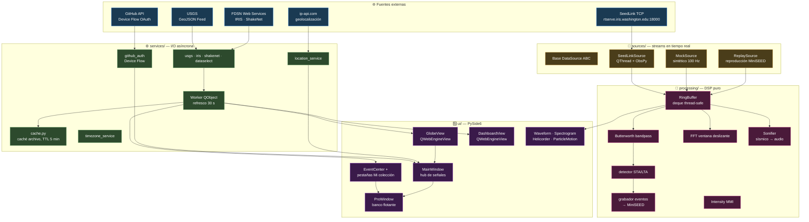
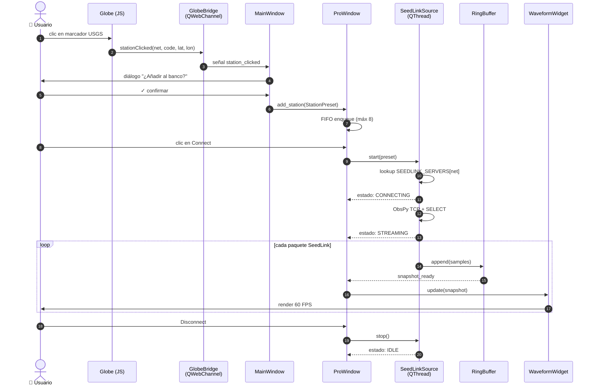
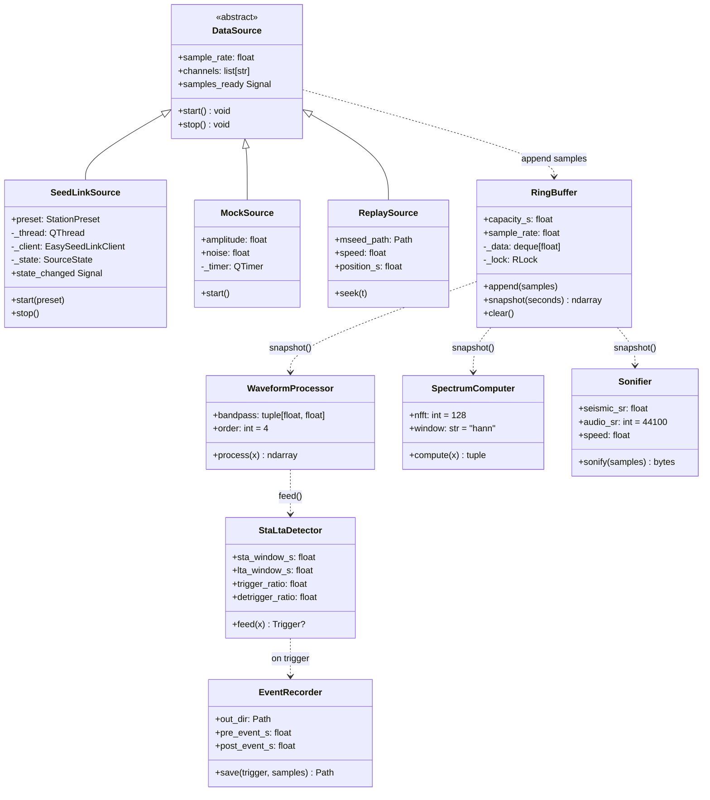
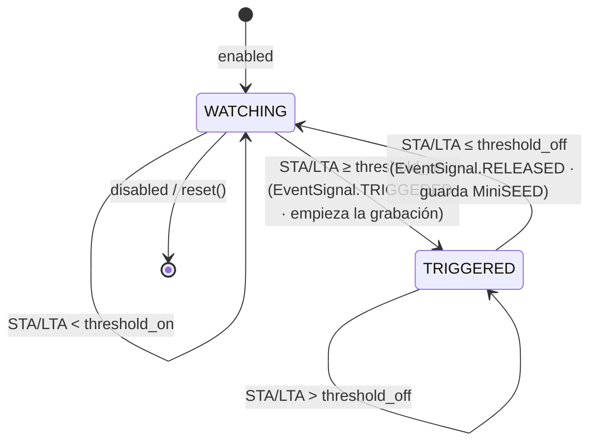
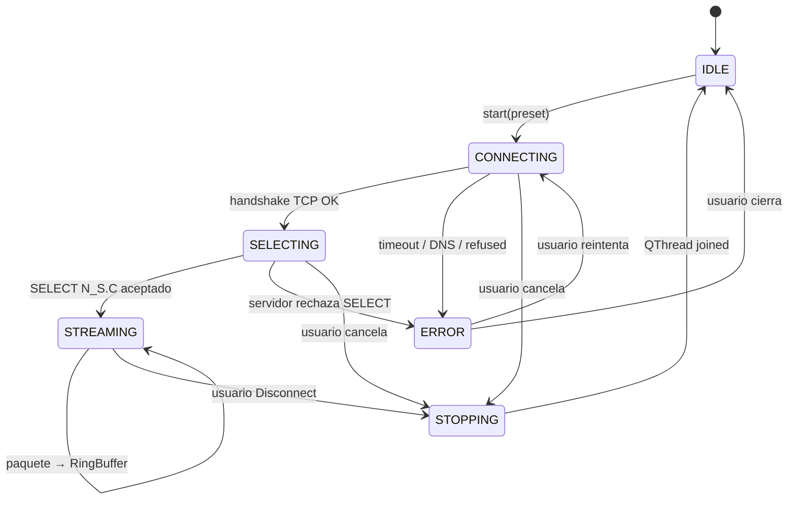

<div align="center">

# 🌐 SeismicGuard

[简体中文](README.md) · [English](README.en.md) · **Español** · [Français](README.fr.md)

> Antes conocido como **ShakeVision OpenData Monitor**. La **v0.8.0**
> reorganiza la app en torno al flujo *evento → revisión → colección
> personal* y reescribe **Replay** como un navegador de formas de onda
> profesional (zoom/pan, eje UTC absoluto, selección de banda, eliminación de
> respuesta a VEL/DISP/ACC, rotación ZNE→ZRT, llegadas teóricas P/S con TauP,
> espectrograma en dB, PSD y exportación PNG/CSV/QuakeML). Añade un **Centro
> de eventos** de nivel superior (tabla de sismos + estaciones cercanas) y una
> pestaña **"Mi colección"** (sismos/estaciones favoritos + grabaciones/
> catálogo de revisión, con reapertura de revisiones guardadas y "Abrir
> carpeta"). Antes, la v0.7.0 incorporó el rebrand a SeismicGuard, el tema
> estilo macOS Sonoma, i18n completo en 4 idiomas, asistente de incorporación,
> perfil con línea de tiempo de actividad y detección de ubicación por IP. Las
> versiones binarias antiguas (v0.1.x) siguen en la página de Releases bajo el
> nombre `ShakeVision-*`.

**Estación de monitoreo sísmico de escritorio, código abierto**
*Cross-platform desktop seismic monitoring workbench*

Consume datos en tiempo real de la red ciudadana global de sismología
(Raspberry Shake) más redes profesionales (USGS / IRIS), y unifica
globo 3D · panel de datos · análisis de formas de onda / espectrograma /
disparo en una sola aplicación de escritorio.

[](https://github.com/yiaogit/seismic-shakevision/actions/workflows/ci.yml)
[](https://github.com/yiaogit/seismic-shakevision/actions/workflows/release.yml)
[](LICENSE)
[](https://www.python.org/downloads/)
[](https://github.com/yiaogit/seismic-shakevision/releases/latest)
[](shakevision/i18n/locales/)

[**Descargar instaladores**](#-descargar) · [**Ejecutar desde el código**](#-ejecutar-desde-el-código) · [**Funciones**](#-funciones) · [**Arquitectura**](#-arquitectura) · [**Publicación**](#-publicación)

</div>

---

## ✨ Funciones

| Módulo                     | Descripción                                                                                                                       |
|----------------------------|-----------------------------------------------------------------------------------------------------------------------------------|
| 🌍 **Globo 3D**            | Renderizado en tiempo real con ECharts-GL, 600+ estaciones ciudadanas Raspberry Shake + 400+ estaciones de la red dorsal USGS / IRIS, sismos coloreados por magnitud, click-zoom + añadir al banco Pro |
| 📊 **Panel de datos**      | 7 gráficas ECharts enlazadas: top países, histogramas magnitud / profundidad, línea temporal 24 h (burbujas de densidad), radar PAGER (filtro por región), buckets autoadaptativos, dispersión profundidad × magnitud |
| 🗂 **Centro de eventos**   | Página de nivel superior: tabla de sismos (doble clic revisa) + **estaciones grandes cercanas** (Δ°/km/categoría); doble clic usa la más cercana; ☆ favoritea sismos/estaciones en un clic |
| ⭐ **"Mi colección"**      | Página de nivel superior: **sismos / estaciones** favoritos + registros (grabaciones STA/LTA — solo si hay + **catálogo de revisión** QuakeML); doble clic en el catálogo **reabre una revisión guardada** (restaura picks P/S); "Abrir carpeta" exporta MiniSEED/QuakeML a ObsPy/SeisComP/SAC |
| 🔬 **Banco Pro**           | Ventana flotante: forma de onda 3 canales + espectrograma (conmutable) + helicórder 24 h + movimiento de partícula N-E (azimut de polarización) + grabación STA/LTA + tarjeta de intensidad MMI |
| ⏪ **Replay (reescrito)**  | Navegador de formas de onda profesional: zoom/pan + eje UTC absoluto + selección de banda + eliminación de respuesta (VEL/DISP/ACC) + rotación ZNE→ZRT + P/S teóricas con TauP + espectrograma en dB + PSD + medidas con cursor de región + exportación PNG/CSV/QuakeML |
| 🔊 **Sonificación**        | Reproduce los últimos 60 segundos del movimiento del suelo como audio audible a velocidad 1× – 60×                                |
| 🌐 **i18n**                | Pila completa de 4 idiomas (EN / ES / 简中 / FR) con cambio instantáneo, incluidas vistas web, internos de gráficas, tooltips y reportes HTML |
| 🕒 **Conciencia de zona**  | Auto-detección de zona horaria del sistema + override manual; todas las marcas de tiempo se renderizan en la zona del usuario     |
| 📄 **Reportes**            | Exportación a un único archivo HTML (con línea de tiempo SVG) + exportación PDF vía `QWebEngine.printToPdf`                       |
| ⚡ **SeedLink en vivo**    | Conexión directa a IRIS `rtserve.iris.washington.edu:18000`, enrutamiento automático IU/US/II/IC, estado de conexión por fases, cancelable en cualquier momento |
| 👤 **Perfil**              | OAuth GitHub (Device Flow), estadísticas de uso, **línea de tiempo de actividad reciente** (últimos 50 eventos con timestamps relativos, almacenados localmente) |
| 📍 **Ubicación**           | Geolocalización por IP (un click, nunca en segundo plano) que sugiere estaciones cercanas y actualiza la zona horaria             |

---

## 📦 Descargar

> **Recomendado para usuarios finales.** Los binarios se compilan en
> GitHub Actions en cada tag; las sumas SHA-256 también se suben
> automáticamente.

Última versión → **[Latest Release](https://github.com/yiaogit/seismic-shakevision/releases/latest)**

| Plataforma                            | Archivo                                        | Cómo instalar                                                |
|---------------------------------------|------------------------------------------------|--------------------------------------------------------------|
| 🪟 **Windows 10 / 11 x64**            | `ShakeVision-X.Y.Z-windows-x64.zip`            | Descomprimir → doble click `ShakeVision.exe` (SmartScreen al primer arranque, ver abajo) |
| 🍎 **macOS Apple Silicon (M1–M5)**    | `ShakeVision-X.Y.Z-macos-arm64.dmg`            | Abrir DMG → arrastrar a `/Applications` → primera vez click derecho → Abrir              |
| 🐧 **Linux x64**                      | `ShakeVision-X.Y.Z-linux-x64.AppImage`         | `chmod +x ShakeVision-*.AppImage` → doble click                                          |

#### 🛡 Aviso del primer arranque (Windows SmartScreen / macOS Gatekeeper)

SeismicGuard **aún no está firmado** (certificado EV ≈ $300/año —
previsto para v1.0). El sistema operativo te avisará al primer
arranque:

<details>
<summary><b>🪟 Windows — "Windows protected your PC"</b></summary>

Tras descomprimir y hacer doble click en `ShakeVision.exe`, aparece un
diálogo azul:

```
Windows protected your PC
Microsoft Defender SmartScreen prevented an unrecognized app from starting.
```

Qué hacer:

1. Pulsa **"More info"** (enlace pequeño, abajo a la izquierda)
2. Aparece un botón **"Run anyway"** — púlsalo
3. Los siguientes arranques no preguntan más

> Solo una vez. Una vez que SmartScreen confía en tu copia local, no
> vuelve a molestar. Si prefieres no pulsar "Run anyway", ejecuta
> desde el código fuente (ver [Ejecutar desde el código](#-ejecutar-desde-el-código)).

</details>

<details>
<summary><b>🍎 macOS — "ShakeVision can't be opened because Apple cannot check it for malicious software"</b></summary>

Tras arrastrar el `.app` a `/Applications`, el primer arranque queda
bloqueado por Gatekeeper:

1. **No** hagas doble click; haz **click derecho (o Ctrl-click)** en
   `ShakeVision.app`
2. Elige **"Open"** del menú
3. Confirma **"Open"** otra vez en el diálogo
4. A partir de ahí, doble click funciona normalmente

</details>

> 🍎 **Usuarios de Mac Intel**: ya no se publican binarios Intel
> (Apple Silicon es mainstream desde hace 4+ años). Compila localmente
> — ver [Ejecutar desde el código](#-ejecutar-desde-el-código).

Verificación opcional de checksums:

```bash
# Tras descargar SHA256SUMS.txt de la página de release
sha256sum -c SHA256SUMS.txt        # Linux
shasum -a 256 -c SHA256SUMS.txt    # macOS
certutil -hashfile <file> SHA256   # Windows PowerShell
```

---

## 💻 Ejecutar desde el código

Para desarrolladores, usuarios de Mac Intel, y quien quiera contribuir.

### Requisitos previos

| SO         | Necesario                                                                                                |
|------------|----------------------------------------------------------------------------------------------------------|
| Todos      | Python ≥ 3.10 (recomendado 3.11 / 3.12) + Git                                                            |
| **Linux**  | `libegl1 libxkbcommon0 libxcb-cursor0 libxcb-icccm4 libgl1 libdbus-1-3` (Ubuntu/Debian `apt install`)    |
| **macOS**  | Xcode Command Line Tools (`xcode-select --install`)                                                      |
| **Windows**| Visual C++ Redistributable (normalmente incluido en el PySide6 que instala pip)                          |

### Arranque en un comando

```bash
# 1) Clonar + entrar
git clone https://github.com/yiaogit/seismic-shakevision.git
cd seismic-shakevision

# 2) Entorno virtual + instalación (con extras de desarrollo)
python3 -m venv .venv
source .venv/bin/activate            # Windows PowerShell: .\.venv\Scripts\activate
pip install --upgrade pip
pip install -e ".[dev]"

# 3) Descarga única de assets (~10 MB: ECharts + fuentes + texturas de globo)
bash scripts/install_libs.sh
bash scripts/install_fonts.sh

# 4) Lanzar
python -m shakevision
```

> 🪟 En Windows, ejecuta el paso 3 con Git Bash / WSL, o descarga
> manualmente las URLs listadas en el script.
> 🍎 Usuarios macOS: `pip install -e ".[macos]"` añade pyobjc para la
> barra de título translúcida.

---

## 🚀 Primeros pasos

```
Lanzar → entra por defecto a la vista 🌍 Globo (sismos + estaciones en vivo)

Ventana principal — 4 pestañas de nivel superior:
  ├── 🌍 Globo    Click en un punto de sismo/estación → Revisar / ☆Favorito / Añadir al Workbench
  ├── 📊 Datos    7 gráficas enlazadas + filtros de periodo / región
  ├── 🗂 Eventos  Tabla de sismos; al seleccionar uno lista "estaciones grandes cercanas" (Δ°/km/categoría)
  │               └── Doble clic en un evento → revísalo con la estación más cercana en Replay
  └── ⭐ Mi col.  Sismos/estaciones favoritos + registros (grabaciones / catálogo de revisión)
                  ├── Doble clic en un sismo favorito → revisar; en una estación favorita → usarla
                  ├── Doble clic en una fila del catálogo → reabrir esa revisión (picks P/S restaurados)
                  └── "Abrir carpeta" → exportar MiniSEED/QuakeML a otro software

🔬 Workbench (ventana independiente, idealmente en un segundo monitor):
  ├── En vivo   Elige estación → Conectar → forma de onda SeedLink 3 canales + espectrograma (conmutable) + tarjeta MMI
  ├── 24h       Helicórder (tambor)
  ├── Partícula Movimiento de partícula N-E + azimut de polarización
  └── Replay    zoom/pan · banda · eliminación de respuesta (VEL/DISP/ACC) · rotación ZNE→ZRT
                · P/S teóricas con TauP · espectrograma dB · PSD · exportar PNG/CSV/QuakeML/catálogo

⚙ Ajustes → cambia idioma + zona horaria, aplicado al instante, sin reiniciar
👤 Perfil  → tarjeta de identidad + estadísticas + línea de tiempo de actividad
```

---

## 🖥 Multimonitor y preguntas frecuentes

**¿Por qué el Workbench es una ventana aparte?** SeismicGuard está pensado para **multimonitor**: deja la ventana principal (Globo/Datos/Eventos/Mi colección) en una pantalla para navegar y pon el 🔬 Workbench en otra para analizar — ambas visibles a la vez, sin solaparse. **Con un solo monitor:** el Workbench puede abrirse detrás de la ventana principal — usa ⌘\` (macOS) / Alt+Tab (Windows) para cambiar, o muévelo a un lado.

<details>
<summary><b>Preguntas frecuentes (FAQ)</b></summary>

- **¿No encuentras un stream público de Raspberry Shake?** No existe un servidor SeedLink público de Raspberry Shake. Solo puedes conectar a tu propio dispositivo en la LAN (`rs.local:18000`) o a un RTDC de pago; todos los streams públicos van por defecto a IRIS `rtserve.iris.washington.edu`.
- **¿Por qué a veces Replay tarda?** **Descarga** la ventana elegida desde IRIS FDSN dataselect bajo demanda; un remoto lento implica espera (la ventana automática está acotada y muestra "calculando"). No está colgado.
- **¿Dónde se guardan favoritos / grabaciones / catálogo?** Todo **local**, sin red ni telemetría: favoritos en QSettings; grabaciones MiniSEED y `catalog.xml` en `~/SeismicGuard/`. Usa "Abrir carpeta" en Mi colección para coger los ficheros; "Ajustes → Limpiar caché" también los borra.
- **¿Bloqueado al primer arranque?** Los binarios no están firmados: en Windows pulsa "Más información → Ejecutar de todas formas" de SmartScreen; en macOS clic derecho en la `.app` → Abrir. Ver Descargar arriba.
- **¿El botón verde en el Workbench de macOS?** Hace zoom en sitio en vez de abrir un Space a pantalla completa — así no acapara un monitor entero.

</details>

---

## 🏗 Arquitectura

### Visión general del sistema

SeismicGuard es una **aplicación de escritorio monolítica** (sin servicio backend) compuesta por cuatro subsistemas claramente estratificados:
**fuentes externas → capa I/O asíncrona (services + sources) → estado en memoria (processing/buffer) → renderizado UI (PySide6 + WebEngine)**.
La comunicación entre hilos pasa por signals/slots de Qt; toda la persistencia va por `QSettings` (sin base de datos).



> Nota: `ReplaySource → Buffer` arriba es la abstracción de **fuente en tiempo real**
> (sintética / replay LAN aún la usan). La **pestaña de Replay histórico** de v0.8 es una
> ruta aparte — **descarga** la ventana elegida directamente de IRIS FDSN dataselect para
> análisis estático (respuesta/rotación/TauP/PSD/exportación) y no pasa por el RingBuffer.

### Secuencia end-to-end: del clic en el globo a la onda en vivo

La ruta más común — **clic en una estación USGS del globo → añadir al banco → conectar SeedLink → ver onda en vivo**:



### Diagrama de clases — processing/ y sources/

La capa DSP es **Python puro** (sin dependencia Qt), así que toda clase se testea por separado en pytest sin necesidad de QApplication.



### Máquinas de estado clave

#### Detector de disparo STA/LTA (`processing/detector.py`)

Es el corazón de "llega un sismo → grabarlo automáticamente" y la máquina de estados más literal del proyecto: para cada bloque calcula la **relación STA/LTA** con **histéresis** — solo entra en TRIGGERED cuando la relación supera `threshold_on`, y solo sale cuando baja de `threshold_off` (dos umbrales distintos evitan el parpadeo en el límite). Entrar/salir emite `EventSignal.TRIGGERED` / `RELEASED`; lo segundo guarda el evento en MiniSEED.



#### Ciclo de vida de SeedLinkSource

> Nota: es un **modelo conceptual**. No hay un enum `SourceState` en el código — en su lugar
> `sources/seedlink.py` es un worker que **emite mensajes `status` de forma secuencial**
> (DNS→TCP→handshake→SELECT→streaming); el diagrama describe sus fases y su proyección
> visual es `ConnectionState` (el LED de 4 estados en `ui/app_header.py`).

El SeedLink público no tiene "desconexión limpia" a nivel de protocolo, así que el objetivo central de esta máquina es **cancelable en cualquier fase**. Antes de v0.6 una fase *CONNECTING* atascada podía congelar la UI; tras esa corrección la máquina final es:



> La reproducción de sonificación (`AudioPlayer`) tiene su propia pequeña máquina de
> estados (IDLE→PREPARING→PLAYING→COMPLETED/ERROR); ver los comentarios en
> `shakevision/ui/audio_player.py` — incluido el caso de macOS donde `QAudioSink` emite
> `IdleState` antes del primer byte (protegido con `_has_been_active` para no dar un
> "terminado" falso).

---

### Pila técnica y registros de decisiones (ADR)

| Capa             | Elección                                            | Decisión clave / razón                                       |
|------------------|-----------------------------------------------------|--------------------------------------------------------------|
| **UI**           | PySide6 ≥ 6.6                                       | **LGPL** permite enlace estático sin contaminación GPL (PyQt6 es GPL); apto comercial |
| **Web**          | QWebEngineView                                      | Chromium embebido sin tercer motor; el flujo OAuth reutiliza el mismo motor |
| **Globo 3D**     | [ECharts-GL](https://github.com/ecomfe/echarts-gl)  | En v0.5 se cambió desde Globe.gl + Three.js: una librería cubre 2D + 3D, bundle ~600 KB vs ~3 MB |
| **Charts 2D**    | [Apache ECharts](https://echarts.apache.org/) 5.4   | Los 7 charts del dashboard comparten una API, interacción/tooltip/tema unificados |
| **DSP**          | NumPy + SciPy                                       | Butterworth estándar de la industria + FFT scipy.signal.spectrogram |
| **Sismología**   | [ObsPy](https://www.obspy.org/) ≥ 1.4               | Cliente SeedLink + lectura/escritura MiniSEED; estándar académico |
| **Waveform**     | [pyqtgraph](https://www.pyqtgraph.org/) 0.13        | Acelerado por GPU, 60 FPS estables                           |
| **Audio**        | QtMultimedia QAudioSink                             | Multiplataforma, cero dependencias extra                     |
| **Timezone**     | `zoneinfo` + `tzdata` (solo Windows) + `tzlocal`    | El registro de Windows dice "China Standard Time", no IANA; `tzlocal` traduce a nombres canónicos |
| **i18n**         | Diccionario JSON propio + helper `t()`              | Python y JS **comparten el mismo diccionario** — sin paso de build, cero deps en runtime |
| **OAuth**        | GitHub Device Flow                                  | **Sin callback URL, sin client secret** — el único flujo OAuth seguro de hornear en binarios open-source |
| **Empaquetado**  | PyInstaller (onedir) + `create-dmg` + `appimagetool` | onedir arranca rápido y es amigable con antivirus (vs onefile extrayéndose a temp y disparando SmartScreen) |
| **CI / Release** | GitHub Actions                                      | Matriz 3 plataformas × Py 3.10–3.12; auto-build + publicación al hacer tag |

**Decisiones arquitectónicas notables:**

1. **Ejecutable único vs microservicios** — los usuarios de escritorio esperan "doble clic para ejecutar"; un artifact PyInstaller de ~250 MB es órdenes de magnitud más simple que pedirles configurar Python.
2. **El SeedLink público de Raspberry Shake no existe** (descubierto en v0.5.1) — solo funcionan dispositivos LAN (`rs.local:18000`) o RTDC de pago. Todos los streams en vivo van por defecto a IRIS `rtserve.iris.washington.edu`.
3. **Namespace QSettings conservado como `SeismicGuard` / `ShakeVision`** — renombrarlo dejaría huérfanos los datos persistidos de los usuarios actuales; el rebrand es solo cosmético.
4. **Comentarios del código en español** — convención del proyecto desde los inicios; mantenido por consistencia estilística. Cadenas de cara al usuario siempre van por i18n.
5. **`DEFAULT_CLIENT_ID` horneado en el binario** (v0.7.5) — los Client IDs de OAuth de GitHub son públicos por diseño y Device Flow no necesita secret; los usuarios reciben sign-in de un clic sin registrar su propia App.
6. **El bundle id macOS sigue siendo `org.shakevision.app`** — cambiarlo haría que macOS tratara v0.7.5 como app nueva, perdiendo posición del Dock y permisos otorgados; mantenerlo es más amigable.

---

### Características de rendimiento

| Componente                   | Throughput / latencia                 | Notas                                              |
|------------------------------|---------------------------------------|----------------------------------------------------|
| `RingBuffer.append`          | O(1), contención de lock < 0.1 ms     | 100 Hz de entrada es trivial                       |
| `RingBuffer.snapshot(60s)`   | ~0.5 ms                               | copia numpy de 6000 floats                         |
| `WaveformProcessor.process`  | ~5 ms / 60s @ 100 Hz                  | Butterworth orden 4, fase cero vía filtfilt       |
| `StaLtaDetector.feed`        | < 1 ms / chunk                        | aproximación streaming de varianza                |
| `SpectrumComputer.compute`   | ~30 ms / 60s @ 100 Hz                 | NFFT=128 por defecto                              |
| Render de waveform           | **60 FPS** sostenidos                 | pyqtgraph acelerado por GPU                       |
| Conexión SeedLink            | 3–8 s típico                          | TCP + SELECT + primer paquete                     |
| Refresco feed USGS           | intervalo 30 s, < 200 KB              | GeoJSON, caché archivo TTL 5 min                  |
| Redibujado del Globo         | < 200 ms                              | M1 con 1000 puntos                                |
| Refresco dashboard (7 charts)| < 100 ms                              | hash de entrada evita redibujados nulos           |
| Chunk de sonificación        | 22050 samples / 0.5 s audio           | Float32 → int16 PCM                              |
| Startup hasta Globo interactivo | ~3 s (macOS arm64)                | Splash oculta el warmup de QtWebEngine            |
| Memoria pico                 | ~450 MB                               | con QtWebEngine + buffer 60s + tres ventanas      |
| Tamaño del instalador        | Windows 95 MB · macOS 110 MB · Linux 130 MB | onedir descomprime a ~220–260 MB         |

---

### Estructura del proyecto y responsabilidades por archivo

```
seismic-shakevision/
├── shakevision/                          # ── paquete Python ──
│   ├── __init__.py                       # constantes __version__ + APP_NAME
│   ├── __main__.py                       # entrada: splash → ventana principal; maneja PyInstaller --windowed stderr=None
│   ├── config.py                         # registro SEEDLINK_SERVERS (IU/US/II/IC → rtserve.iris) + DEFAULT_STATIONS
│   │
│   ├── sources/                          # ── fuentes en tiempo real (4) ──
│   │   ├── base.py                       # DataSource abstracto: start/stop + señal samples_ready
│   │   ├── mock.py                       # Sintético 100 Hz seno + ruido; fuente por defecto
│   │   ├── seedlink.py                   # ObsPy EasySeedLinkClient en QThread; estados por fase, cancelable
│   │   └── replay.py                     # Reproducción MiniSEED a velocidad ajustable (1× – 60×)
│   │
│   ├── processing/                       # ── DSP puro (sin dep Qt) (8) ──
│   │   ├── buffer.py                     # RingBuffer: deque thread-safe + RLock
│   │   ├── filters.py                    # WaveformProcessor: detrend + Butterworth bandpass (filtfilt)
│   │   ├── detector.py                   # Detector STA/LTA + máquina de estado
│   │   ├── spectrum.py                   # FFT ventana deslizante (scipy.signal.spectrogram)
│   │   ├── recorder.py                   # Grabador de eventos, guarda a MiniSEED
│   │   ├── sonifier.py                   # Forma de onda sísmica → audio PCM acelerado
│   │   └── intensity.py                  # PGA → intensidad MMI (Wood-Anderson revisado)
│   │
│   ├── services/                         # ── capa I/O asíncrona (19) ──
│   │   ├── data_models.py                # @dataclass: Earthquake · Station · Trigger · StationPreset
│   │   ├── cache.py                      # Caché de archivo, TTL 5 min, corrección de reloj NTFS en Windows
│   │   ├── worker.py                     # QObject de refresco periódico (30 s) + dual-period slot
│   │   ├── usgs.py                       # Cliente feed USGS GeoJSON de sismos en tiempo real
│   │   ├── iris.py                       # Cliente FDSN station de IRIS (redes IU/US/II)
│   │   ├── shakenet.py                   # Cliente FDSN de Raspberry Shake
│   │   ├── dataselect.py                 # FDSN dataselect de IRIS (descarga MiniSEED)
│   │   ├── report.py                     # Generador de reporte HTML (con timeline SVG)
│   │   ├── timezone_service.py           # Detección de zona horaria del sistema + override; fallback tzlocal
│   │   ├── location_service.py           # Geolocalización IP vía ip-api.com
│   │   ├── activity_log.py               # Log de actividad local (últimos 50 eventos, JSONL)
│   │   ├── usage_tracker.py              # Contador de estadísticas de uso (lanzamientos, segundos escuchados, etc.)
│   │   ├── shake_presets.py              # Persistencia de presets de Shake en LAN
│   │   ├── favorites_store.py            # Sismos / estaciones favoritas
│   │   ├── clear_cache.py                # Borrar todo el estado local en un clic
│   │   ├── github_auth.py                # OAuth GitHub Device Flow; DEFAULT_CLIENT_ID horneado
│   │   └── settings_backup.py            # Export/import JSON de ajustes (solo tests tras v0.7-C)
│   │
│   ├── ui/                               # ── PySide6 (38) ──
│   │   ├── main_window.py                # QMainWindow raíz + hub global de señales + menús
│   │   ├── app_header.py                 # Barra superior (tabs + toggles tema/capa + botones Settings/Profile/Workbench)
│   │   ├── sidebar_nav.py                # Sidebar izquierda de navegación (oculta en layout por defecto)
│   │   ├── globe_view.py                 # GlobeView: QWebEngineView envolviendo web/globe/
│   │   ├── dashboard_view.py             # DashboardView: QWebEngineView envolviendo web/dashboard/
│   │   ├── pro_window.py                 # Ventana flotante independiente del banco (antes "Pro")
│   │   ├── control_panel.py              # Selector de estación + filtro + controles Listen (FIFO 8 estaciones dinámicas)
│   │   ├── waveform_widget.py            # Plot pyqtgraph de 3 canales con scroll
│   │   ├── spectrogram_widget.py         # Espectrograma pyqtgraph ImageItem
│   │   ├── helicorder_widget.py          # Vista de tambor de 24 h
│   │   ├── particle_motion_widget.py     # Movimiento de partícula plano N-E
│   │   ├── intensity_card.py             # Tarjeta de traducción MMI (lenguaje amigable)
│   │   ├── replay_panel.py               # UI de reproducción histórica (datetime + slider velocidad)
│   │   ├── audio_player.py               # Wrapper QAudioSink + máquina de estado
│   │   ├── settings_dialog.py            # Ajustes (General · My Shakes · Reset)
│   │   ├── profile_dialog.py             # Contenedor del diálogo Profile
│   │   ├── profile_view.py               # Contenido Profile (tarjeta GitHub + timeline de actividad)
│   │   ├── github_login_dialog.py        # UI GitHub Device Flow (Intro / Waiting / Success)
│   │   ├── onboarding_wizard.py          # Asistente de primer uso (idioma → zona → tema → fin)
│   │   ├── localizame_view.py            # Escena de detección de ubicación (animación de halo)
│   │   ├── add_shake_dialog.py           # Diálogo Add LAN Shake (con auto-descubrimiento mDNS)
│   │   ├── loading_overlay.py            # Overlay de carga/error
│   │   ├── splash.py                     # Splash de inicio (logo sci-fi + texto de progreso)
│   │   ├── theme.py                      # Paleta + plantillas QSS (incluye QLabel#DialogError etc.)
│   │   ├── theme_manager.py              # Cambio de tema en runtime (light/dark) + señal
│   │   ├── layer_mode_manager.py         # Modo de capa del Globo (day/night/holographic)
│   │   ├── pg_theming.py                 # Suscriptor de paleta pyqtgraph (ejes/grid siguen tema)
│   │   ├── animations.py                 # Funciones factory de respiración/fade/pulso
│   │   ├── elevation.py                  # Helpers de sombra Material/macOS (niveles 0–3)
│   │   ├── icons.py                      # Cargador de iconos empaquetados (svg/png + tema-aware)
│   │   ├── macos_native.py               # Barra de título transparente macOS + vista contenido completo (pyobjc)
│   │   └── pdf_exporter.py               # Wrapper QWebEnginePage.printToPdf
│   │
│   ├── i18n/                             # ── Internacionalización ──
│   │   ├── service.py                    # LocaleService + t() + language_changed_signal
│   │   └── locales/{en,zh,es,fr}.json    # 4 diccionarios alineados, **559 keys cada uno**
│   │
│   ├── web/                              # ── Vistas web embebidas (cargadas por QWebEngineView) ──
│   │   ├── globe/                        # Globo 3D ECharts-GL (index.html + globe.js + styles.css + lib/)
│   │   ├── dashboard/                    # 7 charts ECharts del dashboard (index.html + dashboard.js + ...)
│   │   └── report/                       # Plantilla de reporte HTML
│   │
│   ├── assets/                           # ── Recursos ──
│   │   ├── fonts/{Inter.ttc, JetBrainsMono*.ttf}    # Fuentes (descargadas por script, no en repo)
│   │   ├── icons/                        # Iconos PNG de navegación
│   │   └── branding/{app_icon*.png, logo_for_*.png} # Logo SeismicGuard
│   │
│   └── utils/
│       └── logging.py                    # setup_logging con fallback PyInstaller --windowed
│
├── tests/                                # 50+ módulos pytest (clientes ObsPy mock, unit tests widgets PySide6)
├── packaging/                            # ── Empaquetado ──
│   ├── shakevision.spec                  # Spec de PyInstaller (BUNDLE macOS + VS_VERSIONINFO Win)
│   ├── build.py                          # Driver multiplataforma (post-procesado dmg/AppImage)
│   ├── windows/version_info.txt          # Recurso .exe Windows (CompanyName/FileVersion/etc.)
│   ├── macos/                            # Recursos bundle macOS
│   ├── linux/                            # Recursos AppImage
│   └── README.md                         # Doc profunda de empaquetado
├── scripts/                              # install_libs.sh · install_fonts.sh · download_globe_assets.py
├── .github/workflows/                    # ci.yml (push/PR) + release.yml (disparado por tag)
├── CHANGELOG.md                          # Formato Keep-a-Changelog
├── pyproject.toml                        # Metadatos del paquete + dependencias
├── LICENSE                               # MIT
└── README.{md,en.md,es.md,fr.md}         # README 4 idiomas
```

---

## 🛠 Desarrollo y testing

```bash
# Ejecutar la suite de tests
pytest -v

# Lint
ruff check shakevision tests

# Sanity check de compilación
python -m compileall -q shakevision tests
```

CI corre en cada push / PR: Ubuntu / macOS / Windows × Python 3.10 /
3.11 / 3.12 × (ruff + pytest). Linux usa `xvfb-run`; macOS / Windows
usan `QT_QPA_PLATFORM=offscreen`.

---

## 🌐 Traducciones i18n

Los diccionarios viven en `shakevision/i18n/locales/*.json` (~435
claves cada uno, 4 idiomas alineados al 100 %).

**Añadir un idioma**:

1. Copia `en.json` a un nuevo archivo, p. ej. `ja.json` / `de.json`
2. Traduce cada value (no cambies las keys)
3. Regístralo en `shakevision/i18n/service.py` dentro de
   `SUPPORTED_LANGUAGES` + `LANGUAGE_LABELS`
4. Abre PR

---

## 🚢 Publicación

> Solo mantenedores. Sigue este flujo en cada release.

### Preparación inicial (ya hecho — saltar)

- ✅ `packaging/shakevision.spec` — spec de PyInstaller
- ✅ `packaging/build.py` — driver multiplataforma
- ✅ `.github/workflows/release.yml` — build + publish automático

### Pasos de release (con v0.1.1 como ejemplo)

```bash
# 1) Bump consistente de los 3 números de versión
#    a. shakevision/__init__.py    →  __version__ = "0.1.1"
#    b. pyproject.toml              →  version = "0.1.1"
#    c. packaging/shakevision.spec  →  version = "0.1.1"  (BUNDLE)

# 2) Actualizar CHANGELOG.md: prepender un bloque ## [0.1.1] — YYYY-MM-DD
#    El workflow lo extrae automáticamente como notas del release.

# 3) Commit + push
git add -A
git commit -m "release: v0.1.1"
git push origin main

# 4) Tag + push tag → dispara el release workflow
git tag -a v0.1.1 -m "ShakeVision v0.1.1 — binary installers"
git push origin v0.1.1
```

Tras subir el tag, GitHub Actions ejecuta:

```
release.yml (tag v0.1.1)
  ├── build-windows  (windows-latest, Py 3.11)      → ShakeVision-0.1.1-windows-x64.zip
  ├── build-macos    (macos-14 / Apple Silicon)     → ShakeVision-0.1.1-macos-arm64.dmg
  ├── build-linux    (ubuntu-22.04)                 → ShakeVision-0.1.1-linux-x64.AppImage
  └── publish        (descarga los 3 artifacts)
       ├── extrae el bloque [0.1.1] de CHANGELOG.md como release notes
       ├── ensambla SHA256SUMS.txt
       └── crea el Release en GitHub con 3 binarios + checksums
```

Unos 15–25 minutos después, **v0.1.1** aparece en
https://github.com/yiaogit/seismic-shakevision/releases.

### Pre-releases (rc / beta)

Sufijos `-rc1` / `-beta` / `-alpha` / `-dev` / `-pre` marcan
automáticamente `prerelease: true`:

```bash
git tag -a v0.2.0-rc1 -m "v0.2.0 release candidate 1"
git push origin v0.2.0-rc1
```

### Recuperarse de una release rota

```bash
# Borra el tag remoto (también borra el Release en la UI de GitHub)
git push --delete origin v0.1.1
git tag -d v0.1.1
# Arregla código, re-tag, push
git tag -a v0.1.1 -m "..."
git push origin v0.1.1
```

Detalles completos del empaquetado (compilación local, particularidades
del macOS dual-arch, tamaños, etc.) en
[`packaging/README.md`](packaging/README.md).

---

## 🗺 Hoja de ruta

- [x] **v0.1.0** — release completo desde código (i18n + zona horaria + Pro + Ajustes)
- [x] **v0.1.1** — instaladores binarios (Windows `.zip` + macOS arm64 `.dmg` + Linux `.AppImage`)
- [x] **v0.2.0** — replay histórico: descarga MiniSEED desde IRIS FDSN dataselect con velocidad ajustable
- [x] **v0.3.0** — UI Raspberry Shake LAN personalizado ("➕ Add LAN Shake…" + pestaña "My Shakes")
- [x] **v0.7.0** — rebrand a SeismicGuard, theming macOS-Sonoma, asistente, perfil + actividad, geolocalización IP, fix de overflow en PDF
- [x] **v0.8.0** — Replay reescrito como navegador de formas de onda profesional (respuesta/rotación/TauP/PSD/exportación); Centro de eventos + estaciones cercanas; "Mi colección" (favoritos + grabaciones + catálogo de revisión con reapertura y exportación); entradas de favorito con botón; estabilización del hodograma + azimut de polarización
- [ ] **v1.0.0** — firma de código (Windows EV cert + macOS Developer ID + notarización); elimina por completo los avisos SmartScreen / Gatekeeper; auto-actualización

---

## 📜 Fuentes de datos

- 🍓 [Raspberry Shake](https://raspberryshake.org/) — red de sismología ciudadana, datos abiertos CC-BY
- 🇺🇸 [USGS Earthquake Hazards Program](https://earthquake.usgs.gov/) — feed GeoJSON de sismos
- 🌍 [IRIS DMC](https://ds.iris.edu/) — metadatos de redes profesionales + stream SeedLink (`rtserve.iris.washington.edu`)

> ⚠ **No existe un servidor SeedLink público de Raspberry Shake.** Solo
> puedes conectarte a tu propio dispositivo en LAN (`rs.local:18000`)
> o a una suscripción RTDC de pago. Ver el registro `SEEDLINK_SERVERS`
> en `shakevision/config.py`.

---

## 🤝 Contribuir

Bienvenidos Issues y PRs. Los comentarios de código están en español
(convención histórica del proyecto); los strings al usuario se
externalizan via i18n. Antes de subir, por favor ejecuta:

```bash
ruff check shakevision tests
pytest -v
```

CI debe pasar antes de merge.

---

## 📄 Licencia

[MIT License](LICENSE) © 2025 Yiao

---

## 🙏 Agradecimientos

Gracias a la comunidad [Raspberry Shake](https://raspberryshake.org/)
y al proyecto [ObsPy](https://www.obspy.org/) por la cadena de
herramientas open-source de sismología; y reconocimiento a los
científicos ciudadanos del mundo por su contribución continua al
monitoreo sísmico.
