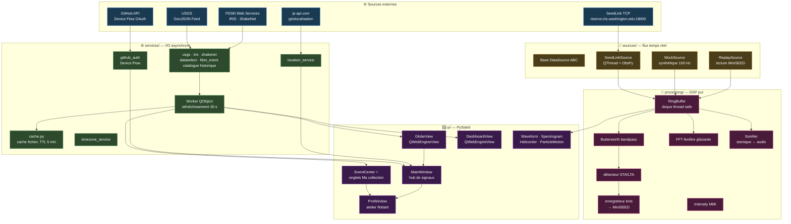
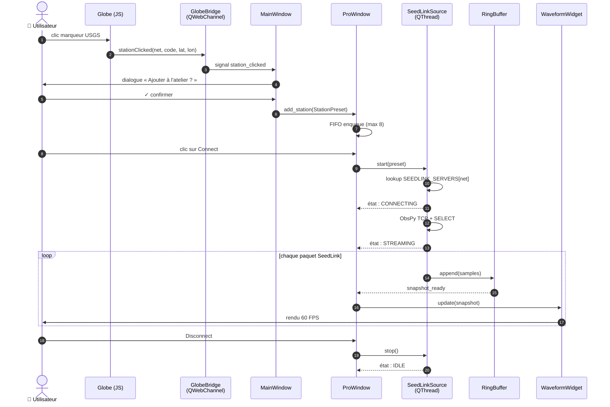
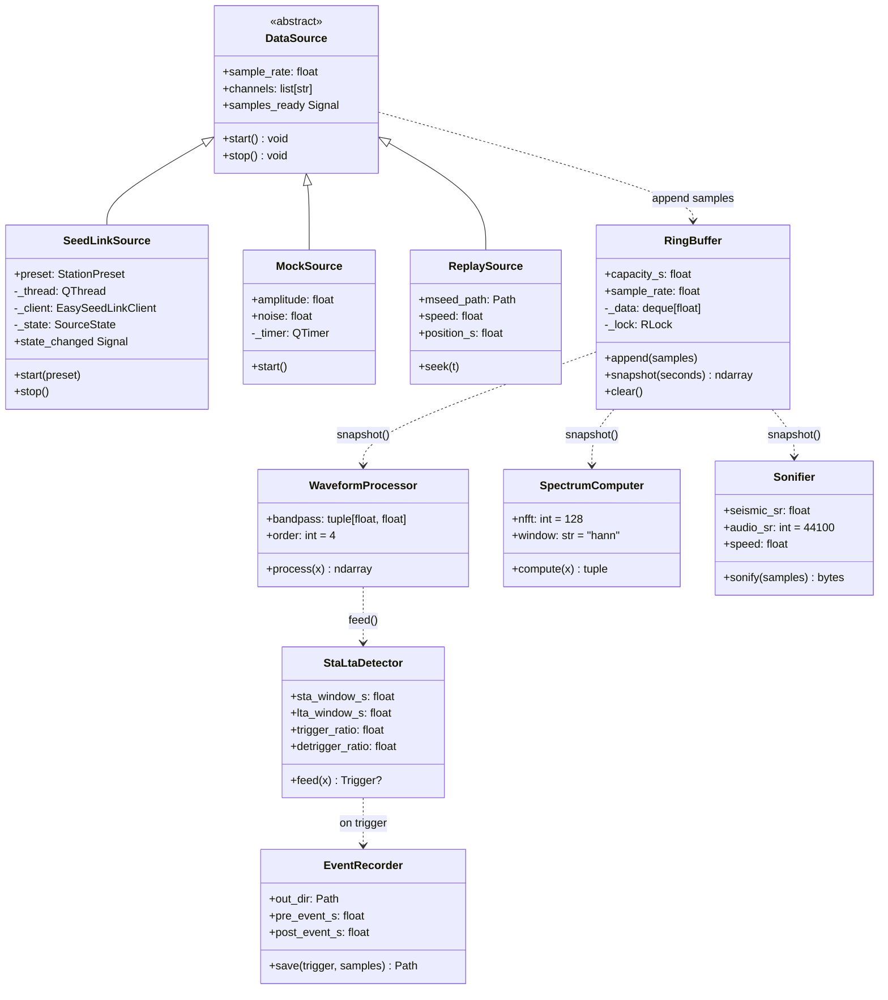
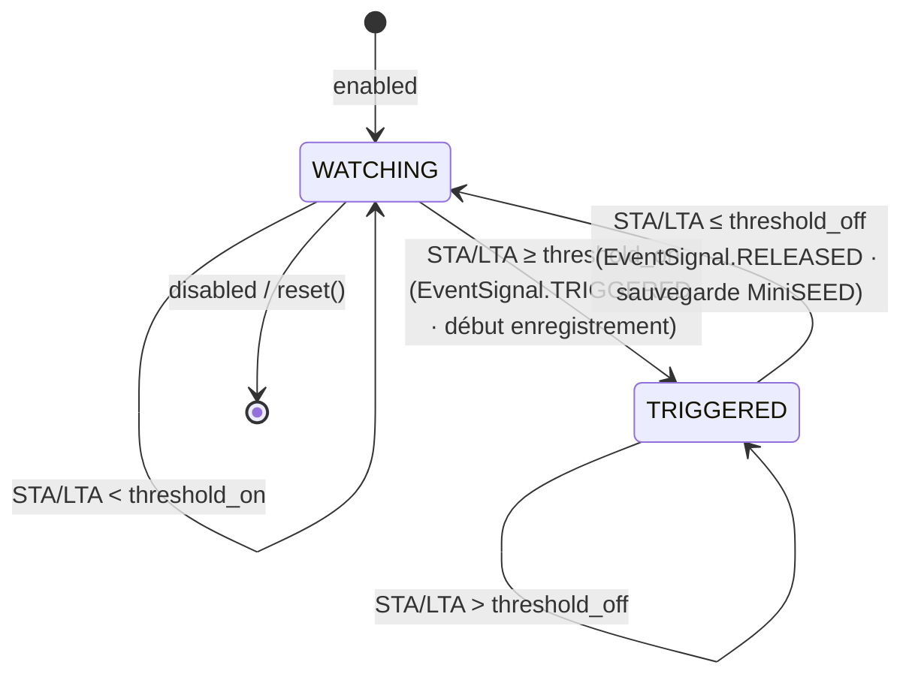
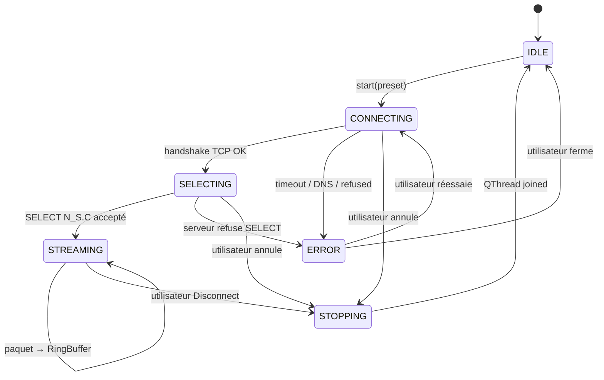

<div align="center">

# 🌐 SeismicGuard

[简体中文](README.md) · [English](README.en.md) · [Español](README.es.md) · **Français**

> Anciennement **ShakeVision OpenData Monitor**. L'amélioration phare de la
> **v0.8.3** est un **catalogue historique de séismes + recherche d'événements
> multilingue** : le Centre d'événements gagne un commutateur Direct/Historique
> qui interroge le catalogue complet USGS **fdsnws-event** ANSS (~1900→aujourd'hui),
> et la recherche fonctionne d'une langue à l'autre (tapez `日本` en chinois pour
> trouver le Japon ; régions Flinn–Engdahl hors-ligne + noms de pays localisés).
> Là-dessus : le **Panneau de données** se scinde en pages **Direct | Analyse**
> (Analyse exécute des **statistiques sismiques professionnelles** sur le catalogue
> historique — valeur b/GR, Mc/b dans le temps, énergie, densité spatiale, coupe
> de profondeur) ; l'**export de rapports** arrive en deux mises en page selon le
> mode (**surveillance / statistique**) ; la sélection du temps utilise un
> **curseur de plage glissant** et les listes déroulantes se dimensionnent dans
> toutes les langues. Auparavant, la
> **v0.8.0** réorganise
> l'application autour du flux *événement → examen → collection personnelle*
> et réécrit **Replay** en navigateur de formes d'onde professionnel (zoom/
> pan, axe UTC absolu, sélection de bande, déconvolution de réponse vers
> VEL/DISP/ACC, rotation ZNE→ZRT, arrivées théoriques P/S via TauP,
> spectrogramme en dB, PSD et export PNG/CSV/QuakeML). Elle ajoute un
> **Centre d'événements** de premier niveau (table de séismes + stations
> proches) et un onglet **« Ma collection »** (séismes/stations favoris +
> enregistrements/catalogue d'examen, avec réouverture des examens
> enregistrés et « Ouvrir le dossier »). Auparavant, la v0.7.0 apportait le
> rebranding en SeismicGuard, le thème façon macOS Sonoma, l'i18n complète en
> 4 langues, l'assistant de configuration, le profil avec timeline d'activité
> et la géolocalisation par IP. Les anciens binaires (v0.1.x) restent
> disponibles sur la page Releases sous le nom `ShakeVision-*`.

**Station de monitoring sismique de bureau, open-source**
*Cross-platform desktop seismic monitoring workbench*

Récupère en temps réel les données du réseau mondial de sismologie
citoyenne (Raspberry Shake) et des réseaux professionnels (USGS / IRIS),
et combine globe 3D · tableau de bord · analyse formes d'onde /
spectrogramme / déclenchement dans une seule application desktop.

[](https://github.com/yiaogit/seismic-shakevision/actions/workflows/ci.yml)
[](https://github.com/yiaogit/seismic-shakevision/actions/workflows/release.yml)
[](LICENSE)
[](https://www.python.org/downloads/)
[](https://github.com/yiaogit/seismic-shakevision/releases/latest)
[](shakevision/i18n/locales/)

[**Télécharger**](#-télécharger) · [**Lancer depuis les sources**](#-lancer-depuis-les-sources) · [**Fonctionnalités**](#-fonctionnalités) · [**Architecture**](#-architecture) · [**Publication**](#-publication)

</div>

---

## ✨ Fonctionnalités

| Module                     | Description                                                                                                                       |
|----------------------------|-----------------------------------------------------------------------------------------------------------------------------------|
| 🌍 **Globe 3D**            | Rendu temps réel ECharts-GL, 600+ stations citoyennes Raspberry Shake + 400+ stations dorsales USGS / IRIS, séismes colorés par magnitude, click-zoom + ajout au banc Pro |
| 📊 **Panneau de données (Direct \| Analyse)** | **Deux pages indépendantes.** **Direct** : top pays, histogrammes magnitude / profondeur, timeline, taux d'événements, épicentres (lon × lat), avec sélecteur de région (le Top-10 reste global). **Analyse** : interroge le **catalogue historique USGS fdsnws-event** (région + fenêtre + magnitude min., pré-vérif `/count`) et produit des stats pro : **valeur b (GR), Mc/b dans le temps, libération d'énergie, densité spatiale, coupe/distribution de profondeur, magnitude-temps, intervalles entre événements**. La fenêtre utilise un **curseur de plage glissant** |
| 🗂 **Centre d'événements** | Page de premier niveau : table de séismes (double-clic examine) + **grandes stations proches** (Δ°/km/catégorie) ; double-clic utilise la plus proche ; ☆ favori séismes/stations en un clic |
| ⭐ **« Ma collection »**   | Page de premier niveau : **séismes / stations** favoris + enregistrements (STA/LTA — seulement s'il y en a + **catalogue d'examen** QuakeML) ; double-clic sur le catalogue **rouvre un examen enregistré** (restaure les pointés P/S) ; « Ouvrir le dossier » exporte MiniSEED/QuakeML vers ObsPy/SeisComP/SAC |
| 🔬 **Banc Pro**            | Fenêtre flottante : formes d'onde 3 canaux + spectrogramme (commutable) + héliographe 24 h + mouvement de particule N-E (azimut de polarisation) + enregistrement STA/LTA + carte d'intensité MMI |
| ⏪ **Replay (réécrit)**    | Navigateur de formes d'onde professionnel : zoom/pan + axe UTC absolu + sélection de bande + déconvolution de réponse (VEL/DISP/ACC) + rotation ZNE→ZRT + P/S théoriques via TauP + spectrogramme en dB + PSD + mesures au curseur de région + export PNG/CSV/QuakeML |
| 🔊 **Sonification**        | Joue les 60 dernières secondes du mouvement du sol en audio audible à vitesse 1× – 60×                                            |
| 🌐 **i18n**                | Stack complète en 4 langues (EN / ES / 简中 / FR) avec changement instantané, y compris vues web, intérieurs de graphiques, tooltips et rapports HTML |
| 🕒 **Fuseau horaire**      | Auto-détection du fuseau système + override manuel ; tous les timestamps affichés dans le fuseau de l'utilisateur                 |
| 📄 **Rapports (deux mises en page)** | HTML + PDF en un seul fichier, **selon le mode** : **Direct** = rapport de surveillance (résumé de situation + classement des pays + timeline + notes sources/données préliminaires) ; **Analyse** = **rapport statistique** (7 graphiques SVG avec axes : GR / énergie / Mc-b / densité spatiale / coupe de profondeur / distribution de profondeur / intervalles + KPIs + **constats** auto-générés + méthodes/provenance/mises en garde + tableau d'événements avec lat/lon et ID). SVG inline pur, sans JS |
| ⚡ **SeedLink en direct**  | Connexion directe à IRIS `rtserve.iris.washington.edu:18000`, routage automatique IU/US/II/IC, statut de connexion par étapes, annulable à tout moment |
| 👤 **Profil**              | OAuth GitHub (Device Flow), statistiques d'usage, **timeline d'activité récente** (50 derniers événements avec timestamps relatifs, stockés localement) |
| 📍 **Localisation**        | Géolocalisation par IP (un clic, jamais en arrière-plan) suggère les stations proches et met à jour le fuseau horaire             |

---

## 📦 Télécharger

> **Recommandé pour les utilisateurs finaux.** Les binaires sont
> compilés par GitHub Actions à chaque tag ; les sommes SHA-256 sont
> également publiées automatiquement.

Dernière version → **[Latest Release](https://github.com/yiaogit/seismic-shakevision/releases/latest)**

| Plateforme                            | Fichier                                        | Installation                                                  |
|---------------------------------------|------------------------------------------------|---------------------------------------------------------------|
| 🪟 **Windows 10 / 11 x64**            | `ShakeVision-X.Y.Z-windows-x64.zip`            | Dézipper → double-clic `ShakeVision.exe` (SmartScreen au premier lancement, voir plus bas) |
| 🍎 **macOS Apple Silicon (M1–M5)**    | `ShakeVision-X.Y.Z-macos-arm64.dmg`            | Ouvrir le DMG → glisser vers `/Applications` → première fois clic droit → Ouvrir           |
| 🐧 **Linux x64**                      | `ShakeVision-X.Y.Z-linux-x64.AppImage`         | `chmod +x ShakeVision-*.AppImage` → double-clic                                            |

#### 🛡 Notes du premier lancement (Windows SmartScreen / macOS Gatekeeper)

SeismicGuard n'est **pas encore signé** (certificat EV ≈ 300 $/an —
prévu pour la v1.0). Le système avertira au premier lancement :

<details>
<summary><b>🪟 Windows — "Windows protected your PC"</b></summary>

Après dézippage et double-clic sur `ShakeVision.exe`, un dialogue
bleu apparaît :

```
Windows protected your PC
Microsoft Defender SmartScreen prevented an unrecognized app from starting.
```

Que faire :

1. Cliquer sur **"More info"** (petit lien, en bas à gauche)
2. Un bouton **"Run anyway"** apparaît — cliquer dessus
3. Les lancements suivants ne demandent plus rien

> Une seule fois. SmartScreen mémorise la confiance locale.

</details>

<details>
<summary><b>🍎 macOS — "ShakeVision can't be opened because Apple cannot check it for malicious software"</b></summary>

Après avoir glissé `.app` dans `/Applications`, le premier lancement
est bloqué par Gatekeeper :

1. **Ne pas** double-cliquer ; faire **clic droit (ou Ctrl-clic)** sur
   `ShakeVision.app`
2. Choisir **"Open"** dans le menu
3. Reconfirmer **"Open"** dans le dialogue
4. À partir de là, le double-clic fonctionne normalement

</details>

> 🍎 **Utilisateurs Mac Intel** : les binaires Intel ne sont plus
> publiés (Apple Silicon est mainstream depuis 4+ ans). Compilez
> localement — voir [Lancer depuis les sources](#-lancer-depuis-les-sources).

Vérification optionnelle des checksums :

```bash
# Après téléchargement de SHA256SUMS.txt depuis la page release
sha256sum -c SHA256SUMS.txt        # Linux
shasum -a 256 -c SHA256SUMS.txt    # macOS
certutil -hashfile <file> SHA256   # Windows PowerShell
```

---

## 💻 Lancer depuis les sources

Pour développeurs, utilisateurs Mac Intel et contributeurs.

### Prérequis

| OS         | Requis                                                                                                   |
|------------|----------------------------------------------------------------------------------------------------------|
| Tous       | Python ≥ 3.10 (3.11 / 3.12 recommandé) + Git                                                             |
| **Linux**  | `libegl1 libxkbcommon0 libxcb-cursor0 libxcb-icccm4 libgl1 libdbus-1-3` (Ubuntu/Debian `apt install`)    |
| **macOS**  | Xcode Command Line Tools (`xcode-select --install`)                                                      |
| **Windows**| Visual C++ Redistributable (généralement fourni par le PySide6 installé via pip)                         |

### Démarrage en une commande

```bash
# 1) Cloner + entrer
git clone https://github.com/yiaogit/seismic-shakevision.git
cd seismic-shakevision

# 2) Env virtuel + installation (avec extras dev)
python3 -m venv .venv
source .venv/bin/activate            # Windows PowerShell: .\.venv\Scripts\activate
pip install --upgrade pip
pip install -e ".[dev]"

# 3) Téléchargement unique des assets (~10 Mo : ECharts + polices + textures globe)
bash scripts/install_libs.sh
bash scripts/install_fonts.sh

# 4) Lancer
python -m shakevision
```

> 🪟 Sous Windows, l'étape 3 s'exécute via Git Bash / WSL, ou téléchargez
> manuellement les URL listées dans le script.
> 🍎 macOS : `pip install -e ".[macos]"` ajoute pyobjc pour la barre
> de titre translucide.

---

## 🚀 Démarrage rapide

```
Lancer → entre par défaut dans la vue 🌍 Globe (séismes + stations en direct)

Fenêtre principale — 4 onglets de premier niveau :
  ├── 🌍 Globe    Clic sur un point séisme/station → Examiner / ☆Favori / Ajouter au Workbench
  ├── 📊 Data     Pages Direct | Analyse (monitoring + stats du catalogue historique)
  ├── 🗂 Events   Table de séismes ; en sélectionner un liste les "grandes stations proches" (Δ°/km/catégorie)
  │               └── Double-clic sur un événement → l'examiner avec la station la plus proche dans Replay
  └── ⭐ Ma col.  Séismes/stations favoris + enregistrements (captures / catalogue d'examen)
                  ├── Double-clic sur un séisme favori → examiner ; sur une station favorite → l'utiliser
                  ├── Double-clic sur une ligne du catalogue → rouvrir cet examen (pointés P/S restaurés)
                  └── "Ouvrir le dossier" → exporter MiniSEED/QuakeML vers un autre logiciel

🔬 Workbench (fenêtre indépendante, idéalement sur un second écran) :
  ├── Direct     Choisir une station → Connect → forme d'onde SeedLink 3 voies + spectrogramme (commutable) + carte MMI
  ├── 24h        Héliographe (tambour)
  ├── Particule  Mouvement de particule N-E + azimut de polarisation
  └── Replay     zoom/pan · bande · déconvolution de réponse (VEL/DISP/ACC) · rotation ZNE→ZRT
                 · P/S théoriques via TauP · spectrogramme dB · PSD · export PNG/CSV/QuakeML/catalogue

⚙ Settings → changer langue + fuseau, appliqué instantanément, sans redémarrage
👤 Profile  → carte identité + statistiques + timeline d'activité
```

---

## 🖥 Multi-écran et FAQ

**Pourquoi le Workbench est-il une fenêtre séparée ?** SeismicGuard est conçu pour le **multi-écran** : gardez la fenêtre principale (Globe/Data/Events/Ma collection) sur un écran pour naviguer et placez le 🔬 Workbench sur un autre pour analyser — les deux visibles à la fois, sans se chevaucher. **Avec un seul écran :** le Workbench peut s'ouvrir derrière la fenêtre principale — utilisez ⌘\` (macOS) / Alt+Tab (Windows) pour basculer, ou déplacez-le sur le côté.

<details>
<summary><b>FAQ</b></summary>

- **Pas de flux Raspberry Shake public ?** Il n'existe pas de serveur SeedLink public Raspberry Shake. Vous ne pouvez vous connecter qu'à votre propre appareil sur le LAN (`rs.local:18000`) ou à un RTDC payant ; tous les flux publics passent par défaut par IRIS `rtserve.iris.washington.edu`.
- **Pourquoi Replay met-il parfois du temps ?** Il **télécharge** la fenêtre choisie depuis IRIS FDSN dataselect à la demande ; un distant lent implique une attente (la fenêtre auto est plafonnée et affiche « calcul en cours »). Ce n'est pas un blocage.
- **Où sont stockés favoris / enregistrements / catalogue ?** Tout en **local**, sans réseau ni télémétrie : favoris dans QSettings ; enregistrements MiniSEED et `catalog.xml` sous `~/SeismicGuard/`. Utilisez « Ouvrir le dossier » dans Ma collection pour récupérer les fichiers ; « Réglages → Vider le cache » les efface aussi.
- **Bloqué au premier lancement ?** Les binaires ne sont pas signés : sous Windows cliquez sur « Informations complémentaires → Exécuter quand même » de SmartScreen ; sous macOS clic droit sur l'`.app` → Ouvrir. Voir Télécharger ci-dessus.
- **Le bouton vert du Workbench macOS ?** Il fait un zoom sur place au lieu d'ouvrir un Space plein écran séparé — il n'accapare donc pas tout un écran.

</details>

---

## 🏗 Architecture

### Vue d'ensemble du système

SeismicGuard est une **application de bureau monolithique** (sans service backend) composée de quatre sous-systèmes clairement stratifiés :
**sources externes → couche I/O asynchrone (services + sources) → état en mémoire (processing/buffer) → rendu UI (PySide6 + WebEngine)**.
La communication inter-thread passe par les signals/slots Qt ; toute persistance va via `QSettings` (pas de base de données).



> Note : `ReplaySource → Buffer` ci-dessus est l'abstraction de **source temps réel**
> (la lecture synthétique / LAN l'utilise encore). L'**onglet Replay historique** de v0.8
> est un chemin distinct — il **télécharge** la fenêtre choisie directement depuis IRIS
> FDSN dataselect pour une analyse statique (déconvolution/rotation/TauP/PSD/export) et ne
> passe pas par le RingBuffer.

### Séquence bout-en-bout : du clic sur le globe à la forme d'onde en direct

Le parcours utilisateur le plus courant — **clic sur une station USGS du globe → ajout à l'atelier → connexion SeedLink → forme d'onde en direct** :



### Diagramme de classes — processing/ et sources/

La couche DSP est **Python pur** (sans dépendance Qt), donc chaque classe est testable indépendamment en pytest sans QApplication.



### Machines à états clés

#### Détecteur de déclenchement STA/LTA (`processing/detector.py`)

C'est le cœur de « un séisme arrive → l'enregistrer automatiquement », et la machine à états la plus littérale du projet : pour chaque bloc il calcule le **rapport STA/LTA** avec **hystérésis** — il n'entre en TRIGGERED que lorsque le rapport dépasse `threshold_on`, et n'en sort que lorsqu'il passe sous `threshold_off` (deux seuils distincts évitent le scintillement à la limite). Entrer/sortir émet `EventSignal.TRIGGERED` / `RELEASED` ; ce dernier écrit l'événement en MiniSEED.



#### Cycle de vie de SeedLinkSource

> Note : c'est un **modèle conceptuel**. Il n'y a pas d'enum `SourceState` dans le code — à
> la place `sources/seedlink.py` est un worker qui **émet des messages `status` de façon
> séquentielle** (DNS→TCP→handshake→SELECT→streaming) ; le diagramme décrit ses phases et sa
> projection visuelle est `ConnectionState` (le LED à 4 états dans `ui/app_header.py`).

Le SeedLink public n'a pas de notion protocolaire de « déconnexion propre », donc l'objectif central de cette machine est **annulable à toute étape**. Avant la v0.6, une phase *CONNECTING* bloquée pouvait figer l'UI ; après cette correction la machine finale est :



> La lecture de sonification (`AudioPlayer`) a sa propre petite machine à états
> (IDLE→PREPARING→PLAYING→COMPLETED/ERROR) ; voir les commentaires dans
> `shakevision/ui/audio_player.py` — y compris le piège macOS où `QAudioSink` émet
> `IdleState` avant le premier octet (protégé par `_has_been_active` pour éviter un faux
> « terminé »).

---

### Stack technique & registres de décisions (ADR)

| Couche           | Choix                                               | Décision clé / justification                                 |
|------------------|-----------------------------------------------------|--------------------------------------------------------------|
| **Framework UI** | PySide6 ≥ 6.6                                       | **LGPL** permet le lien statique sans contamination GPL (PyQt6 est GPL) ; usage commercial possible |
| **Rendu web**    | QWebEngineView                                      | Chromium embarqué sans moteur navigateur tiers ; le flux OAuth réutilise le même moteur |
| **Globe 3D**     | [ECharts-GL](https://github.com/ecomfe/echarts-gl)  | Migré depuis Globe.gl + Three.js en v0.5 : une lib couvre 2D + 3D, bundle ~600 KB vs ~3 MB |
| **Charts 2D**    | [Apache ECharts](https://echarts.apache.org/) 5.4   | Les charts du dashboard partagent une API, interaction/tooltip/thème unifiés |
| **DSP**          | NumPy + SciPy                                       | Butterworth standard industrie + FFT scipy.signal.spectrogram |
| **Sismologie**   | [ObsPy](https://www.obspy.org/) ≥ 1.4               | Client SeedLink + lecture/écriture MiniSEED ; standard académique |
| **Waveform**     | [pyqtgraph](https://www.pyqtgraph.org/) 0.13        | Accéléré GPU, 60 FPS stables                                 |
| **Audio**        | QtMultimedia QAudioSink                             | Multi-plateforme, zéro dépendance supplémentaire             |
| **Fuseau**       | `zoneinfo` + `tzdata` (Windows uniquement) + `tzlocal` | Le registre Windows dit « China Standard Time », pas IANA ; `tzlocal` traduit vers les noms canoniques |
| **i18n**         | Dictionnaire JSON maison + helper `t()`             | Python et JS **partagent le même dictionnaire** — sans build, zéro dép runtime |
| **OAuth**        | GitHub Device Flow                                  | **Pas de callback URL, pas de client secret** — le seul flux OAuth sûr à embarquer dans des binaires open-source |
| **Packaging**    | PyInstaller (onedir) + `create-dmg` + `appimagetool` | onedir démarre vite et est compatible antivirus (vs onefile extrayant dans temp et déclenchant SmartScreen) |
| **CI / Release** | GitHub Actions                                      | Matrice 3 plateformes × Py 3.10–3.12 ; auto-build + publication déclenchés par tag |

**Décisions architecturales notables :**

1. **Exécutable unique vs microservices** — les utilisateurs desktop attendent un « double-clic pour lancer » ; livrer un artifact PyInstaller de ~250 MB est des ordres de grandeur plus simple que demander à l'utilisateur d'installer Python.
2. **Le SeedLink public Raspberry Shake n'existe pas** (découvert en v0.5.1) — seuls les appareils LAN (`rs.local:18000`) ou RTDC payant fonctionnent. Tous les flux temps réel passent par défaut par IRIS `rtserve.iris.washington.edu`.
3. **Namespace QSettings conservé en `SeismicGuard` / `ShakeVision`** — le renommer rendrait orphelines toutes les données persistées des utilisateurs actuels ; le rebrand est purement cosmétique.
4. **Commentaires du code en espagnol** — convention du projet depuis les débuts ; conservé par cohérence stylistique. Les chaînes face à l'utilisateur passent toujours par i18n.
5. **`DEFAULT_CLIENT_ID` embarqué dans le binaire** (v0.7.5) — les Client IDs OAuth GitHub sont publics par conception et Device Flow ne nécessite pas de secret ; les utilisateurs ont le sign-in en un clic sans enregistrer leur propre App.
6. **Le bundle id macOS reste `org.shakevision.app`** — le changer ferait que macOS traite v0.7.5 comme une nouvelle app, perdant la position du Dock et les permissions accordées ; le conserver est plus convivial.

---

### Caractéristiques de performance

| Composant                    | Throughput / latence                  | Notes                                              |
|------------------------------|---------------------------------------|----------------------------------------------------|
| `RingBuffer.append`          | O(1), contention lock < 0.1 ms        | 100 Hz en entrée est trivial                       |
| `RingBuffer.snapshot(60s)`   | ~0.5 ms                               | copie numpy de 6000 floats                         |
| `WaveformProcessor.process`  | ~5 ms / 60s @ 100 Hz                  | Butterworth ordre 4, phase nulle via filtfilt     |
| `StaLtaDetector.feed`        | < 1 ms / chunk                        | approximation streaming de variance               |
| `SpectrumComputer.compute`   | ~30 ms / 60s @ 100 Hz                 | NFFT=128 par défaut                               |
| Rendu waveform               | **60 FPS** soutenus                   | pyqtgraph accéléré GPU                            |
| Connexion SeedLink           | 3–8 s typique                         | TCP + SELECT + premier paquet                     |
| Rafraîchissement feed USGS   | intervalle 30 s, < 200 KB             | GeoJSON, cache fichier TTL 5 min                  |
| Redessin du Globe            | < 200 ms                              | M1 avec 1000 points                               |
| Rafraîchissement dashboard (7) | < 100 ms                            | hash de l'entrée évite les redessins inutiles     |
| Chunk sonification           | 22050 samples / 0.5 s audio           | Float32 → int16 PCM                              |
| Démarrage jusqu'au Globe interactif | ~3 s (macOS arm64)             | Splash masque le warmup QtWebEngine               |
| Mémoire pic                  | ~450 MB                               | avec QtWebEngine + buffer 60s + trois fenêtres    |
| Taille installateur          | Windows 95 MB · macOS 110 MB · Linux 130 MB | onedir décompresse à ~220–260 MB          |

---

### Structure du projet et responsabilités par fichier

```
seismic-shakevision/
├── shakevision/                          # ── package Python ──
│   ├── __init__.py                       # constantes __version__ + APP_NAME
│   ├── __main__.py                       # entrée : splash → fenêtre principale ; gère PyInstaller --windowed stderr=None
│   ├── config.py                         # registre SEEDLINK_SERVERS (IU/US/II/IC → rtserve.iris) + DEFAULT_STATIONS
│   │
│   ├── sources/                          # ── sources temps réel (4) ──
│   │   ├── base.py                       # DataSource abstrait : start/stop + signal samples_ready
│   │   ├── mock.py                       # Synthétique 100 Hz sinus + bruit ; source par défaut
│   │   ├── seedlink.py                   # ObsPy EasySeedLinkClient en QThread ; états par phase, annulable
│   │   └── replay.py                     # Lecture MiniSEED à vitesse ajustable (1× – 60×)
│   │
│   ├── processing/                       # ── DSP pur (sans dép Qt) (8) ──
│   │   ├── buffer.py                     # RingBuffer : deque thread-safe + RLock
│   │   ├── filters.py                    # WaveformProcessor : detrend + Butterworth bandpass (filtfilt)
│   │   ├── detector.py                   # Détecteur d'événements STA/LTA + machine à états
│   │   ├── spectrum.py                   # FFT fenêtre glissante (scipy.signal.spectrogram)
│   │   ├── recorder.py                   # Enregistreur d'événements, sauvegarde en MiniSEED
│   │   ├── sonifier.py                   # Forme d'onde sismique → audio PCM accéléré
│   │   └── intensity.py                  # PGA → intensité MMI (Wood-Anderson révisé)
│   │
│   ├── services/                         # ── couche I/O asynchrone (19) ──
│   │   ├── data_models.py                # @dataclass : Earthquake · Station · Trigger · StationPreset
│   │   ├── cache.py                      # Cache de fichier, TTL 5 min, correction d'horloge NTFS Windows
│   │   ├── worker.py                     # QObject de rafraîchissement périodique (30 s) + dual-period slot
│   │   ├── usgs.py                       # Client feed USGS GeoJSON séismes temps réel
│   │   ├── iris.py                       # Client FDSN station IRIS (réseaux IU/US/II)
│   │   ├── shakenet.py                   # Client FDSN Raspberry Shake
│   │   ├── dataselect.py                 # FDSN dataselect IRIS (téléchargement MiniSEED)
│   │   ├── report.py                     # Générateur de rapport HTML (avec timeline SVG)
│   │   ├── timezone_service.py           # Détection fuseau système + override ; fallback tzlocal
│   │   ├── location_service.py           # Géolocalisation IP via ip-api.com
│   │   ├── activity_log.py               # Journal d'activité local (50 derniers événements, JSONL)
│   │   ├── usage_tracker.py              # Compteur statistiques d'usage (lancements, secondes d'écoute, etc.)
│   │   ├── shake_presets.py              # Persistance des presets Shake LAN
│   │   ├── favorites_store.py            # Séismes / stations favoris
│   │   ├── clear_cache.py                # Effacer tout l'état local en un clic
│   │   ├── github_auth.py                # OAuth GitHub Device Flow ; DEFAULT_CLIENT_ID embarqué
│   │   └── settings_backup.py            # Export/import JSON des réglages (tests uniquement après v0.7-C)
│   │
│   ├── ui/                               # ── PySide6 (38) ──
│   │   ├── main_window.py                # QMainWindow racine + hub global de signaux + menus
│   │   ├── app_header.py                 # Barre supérieure (tabs + toggles thème/couche + boutons Settings/Profile/Workbench)
│   │   ├── sidebar_nav.py                # Sidebar gauche de navigation (cachée dans le layout par défaut)
│   │   ├── globe_view.py                 # GlobeView : QWebEngineView enveloppant web/globe/
│   │   ├── dashboard_view.py             # DashboardView : QWebEngineView enveloppant web/dashboard/
│   │   ├── pro_window.py                 # Fenêtre flottante indépendante de l'atelier (anciennement « Pro »)
│   │   ├── control_panel.py              # Sélecteur de station + filtre + contrôles Listen (FIFO 8 stations dynamiques)
│   │   ├── waveform_widget.py            # Plot pyqtgraph 3 canaux défilant
│   │   ├── spectrogram_widget.py         # Spectrogramme pyqtgraph ImageItem
│   │   ├── helicorder_widget.py          # Vue tambour 24 h
│   │   ├── particle_motion_widget.py     # Mouvement de particule plan N-E
│   │   ├── intensity_card.py             # Carte de traduction MMI (langage convivial)
│   │   ├── replay_panel.py               # UI de rejeu historique (datetime + slider vitesse)
│   │   ├── audio_player.py               # Wrapper QAudioSink + machine à états
│   │   ├── settings_dialog.py            # Réglages (General · My Shakes · Reset)
│   │   ├── profile_dialog.py             # Conteneur du dialogue Profile
│   │   ├── profile_view.py               # Contenu Profile (carte GitHub + timeline d'activité)
│   │   ├── github_login_dialog.py        # UI GitHub Device Flow (Intro / Waiting / Success)
│   │   ├── onboarding_wizard.py          # Assistant premier lancement (langue → fuseau → thème → fin)
│   │   ├── localizame_view.py            # Scène de détection de localisation (animation halo)
│   │   ├── add_shake_dialog.py           # Dialogue Add LAN Shake (avec auto-découverte mDNS)
│   │   ├── loading_overlay.py            # Overlay de chargement/erreur
│   │   ├── splash.py                     # Splash de démarrage (logo sci-fi + texte de progression)
│   │   ├── theme.py                      # Palette + templates QSS (inclut QLabel#DialogError etc.)
│   │   ├── theme_manager.py              # Changement de thème runtime (light/dark) + signal
│   │   ├── layer_mode_manager.py         # Mode de couche du Globe (day/night/holographic)
│   │   ├── pg_theming.py                 # Abonné palette pyqtgraph (axes/grille suivent le thème)
│   │   ├── animations.py                 # Fonctions factory respiration/fade/pulse
│   │   ├── elevation.py                  # Helpers d'ombre Material/macOS (niveaux 0–3)
│   │   ├── icons.py                      # Chargeur d'icônes embarquées (svg/png + thème-aware)
│   │   ├── macos_native.py               # Barre de titre transparente macOS + vue contenu complet (pyobjc)
│   │   └── pdf_exporter.py               # Wrapper QWebEnginePage.printToPdf
│   │
│   ├── i18n/                             # ── Internationalisation ──
│   │   ├── service.py                    # LocaleService + t() + language_changed_signal
│   │   └── locales/{en,zh,es,fr}.json    # 4 dictionnaires alignés, **559 clés chacun**
│   │
│   ├── web/                              # ── Vues web embarquées (chargées par QWebEngineView) ──
│   │   ├── globe/                        # Globe 3D ECharts-GL (index.html + globe.js + styles.css + lib/)
│   │   ├── dashboard/                    # ECharts du dashboard : pages Direct | Analyse (index.html + dashboard.js + ...)
│   │   └── report/                       # Template de rapport HTML
│   │
│   ├── assets/                           # ── Ressources ──
│   │   ├── fonts/{Inter.ttc, JetBrainsMono*.ttf}    # Polices (téléchargées par script, hors repo)
│   │   ├── icons/                        # Icônes PNG de navigation
│   │   └── branding/{app_icon*.png, logo_for_*.png} # Logo SeismicGuard
│   │
│   └── utils/
│       └── logging.py                    # setup_logging avec fallback PyInstaller --windowed
│
├── tests/                                # 50+ modules pytest (clients ObsPy mockés, unit tests widgets PySide6)
├── packaging/                            # ── Packaging ──
│   ├── shakevision.spec                  # Spec PyInstaller (BUNDLE macOS + VS_VERSIONINFO Win)
│   ├── build.py                          # Driver multi-plateforme (post-traitement dmg/AppImage)
│   ├── windows/version_info.txt          # Ressource .exe Windows (CompanyName/FileVersion/etc.)
│   ├── macos/                            # Ressources bundle macOS
│   ├── linux/                            # Ressources AppImage
│   └── README.md                         # Doc approfondie de packaging
├── scripts/                              # install_libs.sh · install_fonts.sh · download_globe_assets.py
├── .github/workflows/                    # ci.yml (push/PR) + release.yml (déclenché par tag)
├── CHANGELOG.md                          # Format Keep-a-Changelog
├── pyproject.toml                        # Métadonnées du package + dépendances
├── LICENSE                               # MIT
└── README.{md,en.md,es.md,fr.md}         # README 4 langues
```

---

## 🛠 Développement & tests

```bash
# Lancer la suite de tests
pytest -v

# Lint
ruff check shakevision tests

# Sanity check de compilation
python -m compileall -q shakevision tests
```

CI tourne à chaque push / PR : Ubuntu / macOS / Windows × Python 3.10 /
3.11 / 3.12 × (ruff + pytest). Linux utilise `xvfb-run` ; macOS /
Windows utilisent `QT_QPA_PLATFORM=offscreen`.

---

## 🌐 Traductions i18n

Les dictionnaires vivent dans `shakevision/i18n/locales/*.json`
(≈ 435 clés chacun, 4 langues alignées à 100 %).

**Ajouter une langue** :

1. Copier `en.json` vers un nouveau fichier, p. ex. `ja.json` / `de.json`
2. Traduire chaque value (ne pas changer les keys)
3. Enregistrer dans `shakevision/i18n/service.py` sous
   `SUPPORTED_LANGUAGES` + `LANGUAGE_LABELS`
4. Ouvrir une PR

---

## 🚢 Publication

> Mainteneurs uniquement. Suivre ce flux à chaque release.

### Préparation unique (déjà en place — passer)

- ✅ `packaging/shakevision.spec` — spec PyInstaller
- ✅ `packaging/build.py` — driver multi-plateforme
- ✅ `.github/workflows/release.yml` — build + publication auto

### Étapes de release (avec v0.1.1 comme exemple)

```bash
# 1) Bumper les 3 numéros de version de manière cohérente
#    a. shakevision/__init__.py    →  __version__ = "0.1.1"
#    b. pyproject.toml              →  version = "0.1.1"
#    c. packaging/shakevision.spec  →  version = "0.1.1"  (BUNDLE)

# 2) Mettre à jour CHANGELOG.md : préfixer un bloc ## [0.1.1] — YYYY-MM-DD
#    Le workflow l'extrait automatiquement comme release notes.

# 3) Commit + push
git add -A
git commit -m "release: v0.1.1"
git push origin main

# 4) Tag + push tag → déclenche le release workflow
git tag -a v0.1.1 -m "ShakeVision v0.1.1 — binary installers"
git push origin v0.1.1
```

Après le push du tag, GitHub Actions exécute :

```
release.yml (tag v0.1.1)
  ├── build-windows  (windows-latest, Py 3.11)      → ShakeVision-0.1.1-windows-x64.zip
  ├── build-macos    (macos-14 / Apple Silicon)     → ShakeVision-0.1.1-macos-arm64.dmg
  ├── build-linux    (ubuntu-22.04)                 → ShakeVision-0.1.1-linux-x64.AppImage
  └── publish        (récupère les 3 artifacts)
       ├── extrait le bloc [0.1.1] de CHANGELOG.md comme release notes
       ├── assemble SHA256SUMS.txt
       └── crée la Release GitHub avec les 3 binaires + checksums
```

Environ 15–25 minutes plus tard, **v0.1.1** apparaît sur
https://github.com/yiaogit/seismic-shakevision/releases.

### Pré-releases (rc / beta)

Les suffixes `-rc1` / `-beta` / `-alpha` / `-dev` / `-pre` marquent
automatiquement `prerelease: true` :

```bash
git tag -a v0.2.0-rc1 -m "v0.2.0 release candidate 1"
git push origin v0.2.0-rc1
```

### Récupérer une release ratée

```bash
# Supprimer le tag distant (supprimer aussi la Release dans l'UI GitHub)
git push --delete origin v0.1.1
git tag -d v0.1.1
# Corriger, re-tagger, push
git tag -a v0.1.1 -m "..."
git push origin v0.1.1
```

Détails complets sur le packaging (builds locaux, particularités du
macOS dual-arch, tailles, etc.) dans
[`packaging/README.md`](packaging/README.md).

---

## 🗺 Feuille de route

- [x] **v0.1.0** — release complète depuis les sources (i18n + fuseau + Pro + Settings)
- [x] **v0.1.1** — installeurs binaires (Windows `.zip` + macOS arm64 `.dmg` + Linux `.AppImage`)
- [x] **v0.2.0** — replay historique : téléchargement MiniSEED depuis IRIS FDSN dataselect, vitesse ajustable
- [x] **v0.3.0** — UI Raspberry Shake LAN personnalisé ("➕ Add LAN Shake…" + onglet "My Shakes")
- [x] **v0.7.0** — rebranding SeismicGuard, theming macOS-Sonoma, assistant, profil + activité, géolocalisation IP, correctif overflow PDF
- [x] **v0.8.0** — Replay réécrit en navigateur de formes d'onde professionnel (réponse/rotation/TauP/PSD/export) ; Centre d'événements + stations proches ; « Ma collection » (favoris + enregistrements + catalogue d'examen avec réouverture et export) ; entrées favori par bouton ; stabilisation du mouvement de particule + azimut de polarisation
- [ ] **v1.0.0** — signature de code (Windows EV cert + macOS Developer ID + notarisation) ; suppression complète des avertissements SmartScreen / Gatekeeper ; mise à jour automatique

---

## 📜 Sources de données

- 🍓 [Raspberry Shake](https://raspberryshake.org/) — réseau de sismologie citoyenne, données ouvertes CC-BY
- 🇺🇸 [USGS Earthquake Hazards Program](https://earthquake.usgs.gov/) — flux GeoJSON sismes
- 🌍 [IRIS DMC](https://ds.iris.edu/) — métadonnées réseaux pro + stream SeedLink direct (`rtserve.iris.washington.edu`)

> ⚠ **Aucun serveur SeedLink Raspberry Shake public n'existe.** Vous ne
> pouvez vous connecter qu'à votre propre appareil LAN
> (`rs.local:18000`) ou à un abonnement RTDC payant. Voir le registre
> `SEEDLINK_SERVERS` dans `shakevision/config.py`.

---

## 🤝 Contribuer

Issues et PRs bienvenus. Les commentaires de code sont en espagnol
(convention historique du projet) ; les chaînes utilisateur sont
externalisées via i18n. Avant soumission, merci de lancer :

```bash
ruff check shakevision tests
pytest -v
```

CI doit passer avant merge.

---

## 📄 Licence

[MIT License](LICENSE) © 2025 Yiao

---

## 🙏 Remerciements

Merci à la communauté [Raspberry Shake](https://raspberryshake.org/)
et au projet [ObsPy](https://www.obspy.org/) pour la chaîne d'outils
sismologique open-source ; et hommage aux scientifiques citoyens du
monde entier pour leur contribution continue au monitoring sismique.
