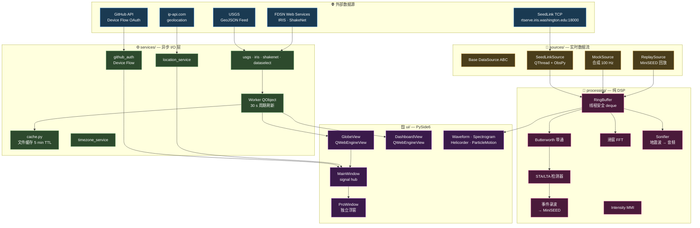
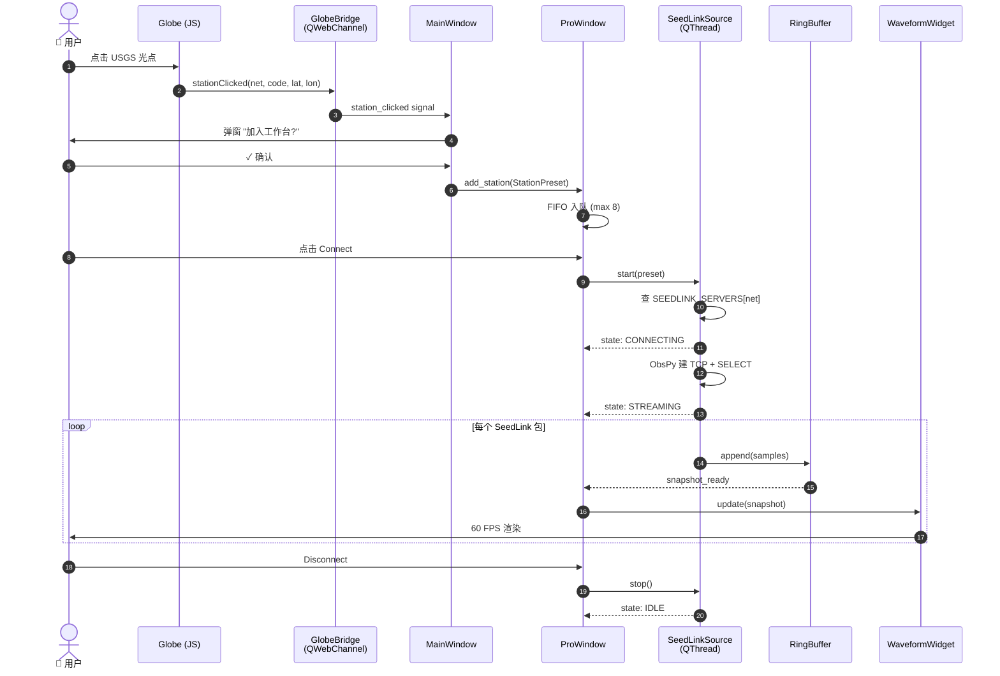
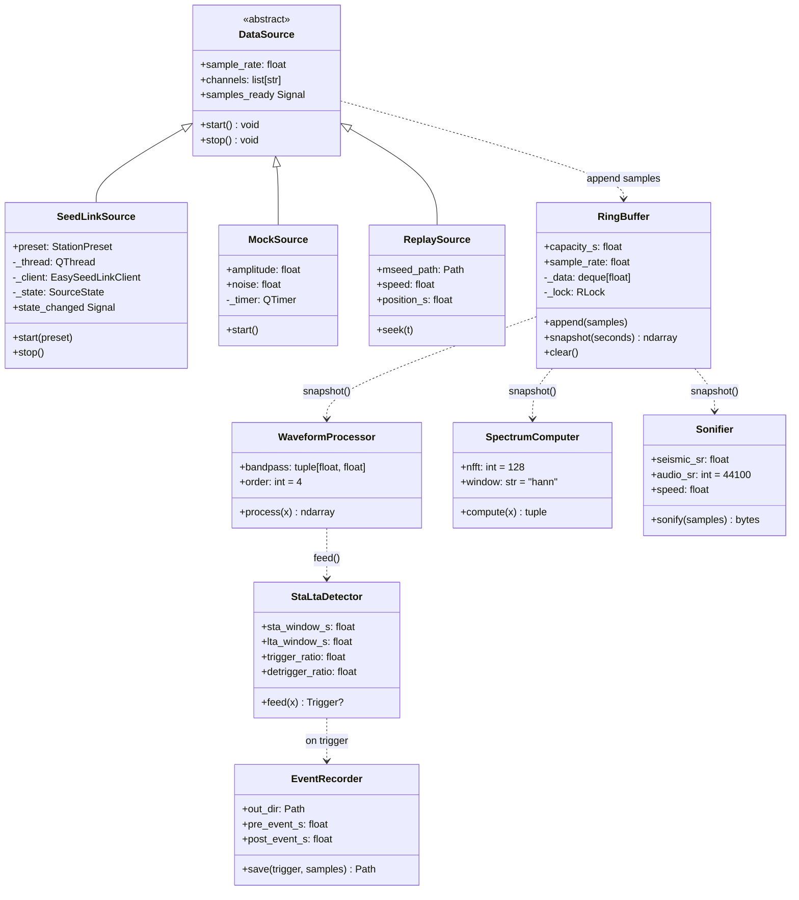
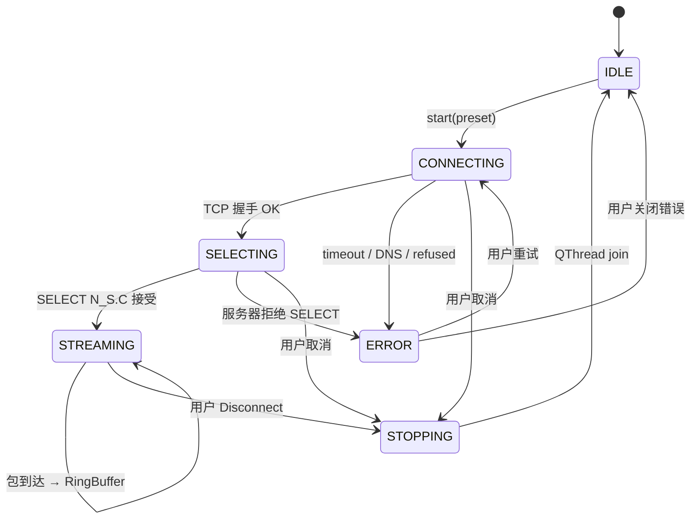
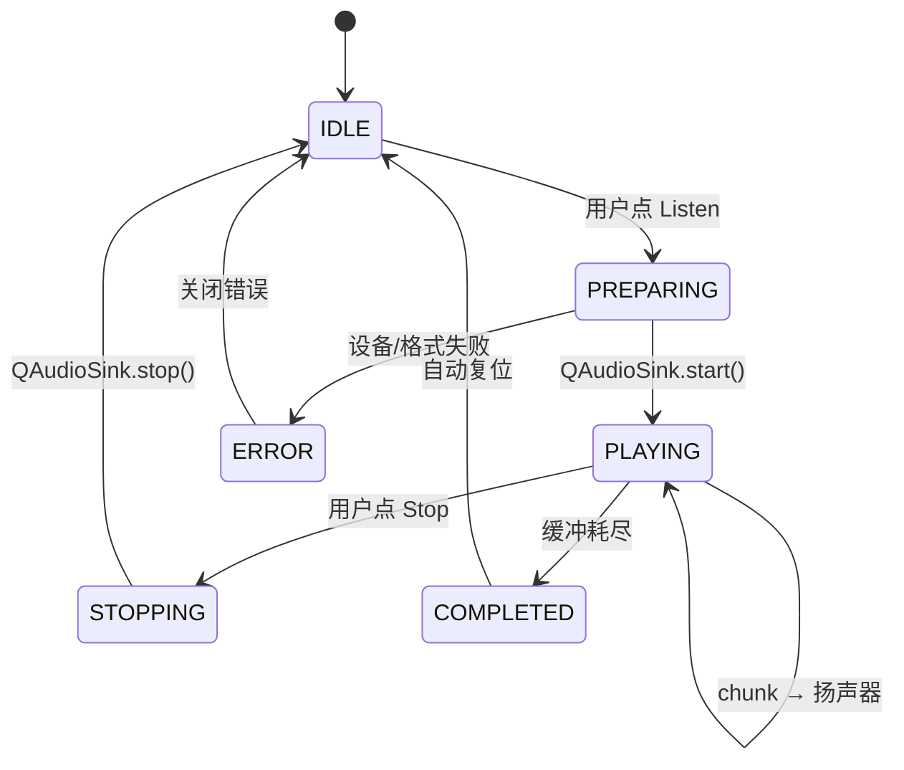

<div align="center">

# 🌐 SeismicGuard

**简体中文** · [English](README.en.md) · [Español](README.es.md) · [Français](README.fr.md)

> 原名 **ShakeVision OpenData Monitor**。v0.7.0 完成 SeismicGuard 品牌重塑、
> macOS Sonoma 风格主题、全栈 4 语言 i18n、Onboarding 引导、Profile 活动时间线、
> IP 地理定位等大量改进。历史的 v0.1.x 二进制仍以 `ShakeVision-*` 名字保留在
> Releases 页面。

**桌面级开源地震监测可视化工作站**
*Cross-platform desktop seismic monitoring workbench*

实时拉取全球公民地震网（Raspberry Shake）+ USGS / IRIS 专业台网数据，
融合 3D 地球 · 数据看板 · 波形/频谱/触发分析于一体的单体桌面应用。

[](https://github.com/yiaogit/seismic-shakevision/actions/workflows/ci.yml)
[](https://github.com/yiaogit/seismic-shakevision/actions/workflows/release.yml)
[](LICENSE)
[](https://www.python.org/downloads/)
[](https://github.com/yiaogit/seismic-shakevision/releases/latest)
[](shakevision/i18n/locales/)

[**下载安装包**](#-下载安装) · [**从源码运行**](#-从源码运行) · [**功能速览**](#-功能速览) · [**架构**](#-架构) · [**发布流程**](#-发布流程)

</div>

---

## ✨ 功能速览

| 模块                       | 内容                                                                                                                            |
|---------------------------|---------------------------------------------------------------------------------------------------------------------------------|
| 🌍 **3D Globe**           | ECharts-GL 实时渲染地球，叠加 600+ Raspberry Shake 公民台站 + 400+ USGS / IRIS 骨干台站，地震按震级分色，可点击缩放并加入 Pro 工作台 |
| 📊 **Data Dashboard**     | 7 张联动 ECharts：Top 国家、震级/深度直方图、24h 时间线（自适应密度气泡）、PAGER 雷达（区域过滤器）、周期自适应桶图、深度×震级散点  |
| 🔬 **Pro Workbench**      | 独立浮窗：实时三通道波形 + 频谱图 + 24h 鼓式记录 + N-E 质点轨迹 + STA/LTA 触发录波 + MMI 烈度卡                                  |
| 🔊 **Sonification**       | 把最近 60 秒的地动信号变速并播放成可听音频（1× – 60×）                                                                            |
| 🌐 **i18n**               | 全栈 4 语言（EN / ES / 简中 / FR）即时切换，包括 Web 视图、图表内部、tooltip、HTML 报告                                          |
| 🕒 **时区感知**           | 系统时区自动检测 + 手动覆盖；所有时间戳一致显示用户时区                                                                          |
| 📄 **报告导出**           | 一键导出单文件 HTML 报告（含 SVG 时间线）+ PDF 导出（QWebEngine printToPdf，v0.7 修复内容溢出）                                  |
| ⚡ **实时 SeedLink**      | 直连 IRIS `rtserve.iris.washington.edu:18000`，IU/US/II/IC 网络自动路由，分阶段连接状态显示，可随时取消                          |
| 👤 **个人中心**           | GitHub OAuth（Device Flow）+ 使用统计 + **最近活动时间线**（最近 50 条操作，相对时间戳，仅本地存储）                              |
| 📍 **位置检测**           | IP 地理定位（一键，永不后台调用）推荐附近台站并同步时区                                                                          |

---

## 📦 下载安装

> **推荐普通用户走这条路。** 二进制由 GitHub Actions 在每个 tag 上自动构建，
> SHA-256 校验和也由 Actions 自动写入 Release。

最新版本在 → **[Latest Release](https://github.com/yiaogit/seismic-shakevision/releases/latest)**

| 平台                              | 下载文件                                       | 安装方式                                              |
|-----------------------------------|------------------------------------------------|-------------------------------------------------------|
| 🪟 **Windows 10 / 11 x64**        | `ShakeVision-X.Y.Z-windows-x64.zip`            | 解压 → 双击 `ShakeVision.exe`（**首次**会触发 SmartScreen，见下） |
| 🍎 **macOS Apple Silicon (M1–M5)**| `ShakeVision-X.Y.Z-macos-arm64.dmg`            | 打开 DMG → 拖入 `/Applications` → 首次右键 → 打开                |
| 🐧 **Linux x64**                  | `ShakeVision-X.Y.Z-linux-x64.AppImage`         | `chmod +x ShakeVision-*.AppImage` → 双击                          |

#### 🛡 Windows SmartScreen / macOS Gatekeeper 首次启动须知

ShakeVision 当前**未做代码签名**（EV 证书约 $300/年；列入 v1.0 路线图）。
因此首次启动时操作系统会拦截：

<details>
<summary><b>🪟 Windows — "Windows protected your PC"</b></summary>

下载完 ZIP 解压后双击 `ShakeVision.exe`，会看到蓝色弹窗：

```
Windows protected your PC
Microsoft Defender SmartScreen prevented an unrecognized app from starting.
```

操作：

1. 点弹窗里的 **"More info"**（左下角小字）
2. 弹窗展开后出现 **"Run anyway"** 按钮 —— 点它
3. 之后再启动就不会再问

> 这一步只需做一次。SmartScreen 在你的本地建立信任后，下次直接打开。
> 如果你不愿点 "Run anyway"，可以从源码运行（见 [从源码运行](#-从源码运行)）。

</details>

<details>
<summary><b>🍎 macOS — "ShakeVision can't be opened because Apple cannot check it for malicious software"</b></summary>

把 `.app` 拖到 `/Applications` 后第一次启动时，会被 Gatekeeper 拦下。操作：

1. **不要** 双击启动；改为 **右键（或按住 Control + 点击）** `ShakeVision.app`
2. 选择菜单里的 **"Open"**
3. 弹窗里再点 **"Open"** 确认
4. 之后正常双击即可

</details>

> 🍎 **Intel Mac 用户**：不再发布 Intel 二进制（M1+ 已主导市场超过 4 年）。
> 请按 [从源码运行](#-从源码运行) 部分本地构建。

校验和检查（可选）：

```bash
# 在 Release 页面下载 SHA256SUMS.txt 后
sha256sum -c SHA256SUMS.txt        # Linux
shasum -a 256 -c SHA256SUMS.txt    # macOS
certutil -hashfile <file> SHA256   # Windows PowerShell
```

---

## 💻 从源码运行

适合开发者、Intel Mac 用户，以及想做二次开发或 PR 的同学。

### 前置依赖

| 系统      | 必需                                                                                              |
|-----------|---------------------------------------------------------------------------------------------------|
| 所有平台  | Python ≥ 3.10（推荐 3.11 / 3.12）+ Git                                                            |
| **Linux** | `libegl1 libxkbcommon0 libxcb-cursor0 libxcb-icccm4 libgl1 libdbus-1-3`（Ubuntu/Debian `apt install`） |
| **macOS** | Xcode Command Line Tools（`xcode-select --install`）                                              |
| **Windows** | Visual C++ Redistributable（pip 装 PySide6 时通常已自带）                                       |

### 一键启动

```bash
# 1) 克隆 + 进入
git clone https://github.com/yiaogit/seismic-shakevision.git
cd seismic-shakevision

# 2) 虚拟环境 + 安装（含开发依赖）
python3 -m venv .venv
source .venv/bin/activate            # Windows PowerShell: .\.venv\Scripts\activate
pip install --upgrade pip
pip install -e ".[dev]"

# 3) 一次性资源下载（≈10 MB：ECharts + 字体 + 地球纹理）
bash scripts/install_libs.sh
bash scripts/install_fonts.sh

# 4) 启动
python -m shakevision
```

> 🪟 Windows 上 step 3 用 Git Bash / WSL 运行 bash 脚本即可；或手动下载脚本里列的 URL 到对应目录。
> 🍎 macOS 用户可选 `pip install -e ".[macos]"` 装 pyobjc 享受透明标题栏。

---

## 🚀 快速上手

```
启动 → 默认进入 🌍 Globe 视图
  ├── 点击任意 USGS 光点 → 弹窗"添加到 Pro?" → ✅ → 浮现在 Pro 控制面板下拉
  ├── 切换 📊 Data → 查看 7 张联动图表 + 周期 / 区域过滤
  └── 右上 🔬 Pro → 打开独立的专业窗口
                    ├── 选刚才加入的 USGS 台站
                    ├── 点 Connect → 走 SeedLink 实时流
                    └── 看实时波形 / 频谱 / 鼓式记录 / 质点轨迹

右上 ⚙ Settings → 切语言 + 时区，立即生效，无需重启
```

---

## 🏗 架构

### 系统总览

SeismicGuard 是一个**单体桌面应用**（无后端服务），由 4 个清晰分层的子系统组成：
**外部数据源 → 异步 I/O 层（services + sources）→ 内存状态（processing/buffer）→ UI 渲染（PySide6 + WebEngine）**。
所有跨线程通信走 Qt signal/slot，所有持久化状态走 `QSettings`（无数据库）。



### 端到端时序：从点击地球到看到波形

下图覆盖最常见的用户路径 —— **在地球上点 USGS 台站 → 加入工作台 → 连接 SeedLink → 看到实时波形**。



### 核心类图 — processing/ 与 sources/

DSP 层是**纯 Python**（无 Qt 依赖），所有类可在 pytest 里独立测试，不需要 QApplication。



### 关键状态机

#### SeedLinkSource 生命周期

公开 SeedLink 没有官方"协议优雅断开"的概念，所以这套状态机的核心目标是**任何阶段都能取消** —— v0.6 之前曾有 *CONNECTING* 永远阻塞导致 UI 假死的崩溃，那次修复后的最终状态机如下：



#### AudioPlayer（地震波声学化）



---

### 技术栈与决策记录（ADR）

| 层               | 选型                                                | 关键决策 / 理由                                              |
|------------------|-----------------------------------------------------|--------------------------------------------------------------|
| **UI 框架**      | PySide6 ≥ 6.6                                       | **LGPL** 允许静态链接而无 GPL 污染（PyQt6 是 GPL）；商业友好 |
| **Web 渲染**     | QWebEngineView                                      | 嵌入 Chromium，无需额外浏览器引擎；OAuth 流程也复用同一引擎  |
| **3D 地球**      | [ECharts-GL](https://github.com/ecomfe/echarts-gl)  | v0.5 从 Globe.gl + Three.js 切换：一个库覆盖 2D + 3D，bundle ~600 KB vs 原来 ~3 MB |
| **2D 图表**      | [Apache ECharts](https://echarts.apache.org/) 5.4   | 7 张图全用同一 API，统一交互 / tooltip / 主题                |
| **DSP**          | NumPy + SciPy                                       | 工业标准 Butterworth + scipy.signal.spectrogram FFT          |
| **地震学**       | [ObsPy](https://www.obspy.org/) ≥ 1.4               | SeedLink 客户端 + MiniSEED 读写；学术标准                    |
| **波形绘制**     | [pyqtgraph](https://www.pyqtgraph.org/) 0.13        | GPU 加速，60 FPS 稳定                                        |
| **音频**         | QtMultimedia QAudioSink                             | 跨平台，零额外依赖                                           |
| **时区**         | `zoneinfo` + `tzdata`（仅 Windows） + `tzlocal`     | Windows 注册表是 "China Standard Time" 不是 IANA 名，`tzlocal` 兜底翻译 |
| **i18n**         | 自研 JSON 字典 + `t()` 函数                          | Python 与 JS **共享同一份字典**，无构建步骤；零运行时依赖    |
| **OAuth**        | GitHub Device Flow                                  | **无 callback URL，无 client secret** —— 唯一可以安全烘焙进开源二进制的 OAuth 流程 |
| **打包**         | PyInstaller (onedir) + `create-dmg` + `appimagetool` | onedir 启动快，杀软友好（vs onefile 解压到 temp 触发 SmartScreen） |
| **CI / Release** | GitHub Actions                                      | 3 平台 × Py 3.10–3.12 矩阵；tag 触发自动构建 + 发布          |

**重要决策记录：**

1. **单一可执行包 vs 微服务** — 桌面用户期待"双击即用"，shipping 一个 ~250 MB 的 PyInstaller artifact 比让用户配 Python 简单几个数量级。
2. **公开 Raspberry Shake SeedLink 不存在**（v0.5.1 发现） — 只能连 LAN 内自己的设备 (`rs.local:18000`) 或付费 RTDC。所有实时流默认路由到 IRIS `rtserve.iris.washington.edu`。
3. **QSettings 命名空间保留 `SeismicGuard` / `ShakeVision`** — 改名会孤立现有用户的所有持久化数据；rebrand 仅限可见层面。
4. **代码注释使用西班牙语** — 项目早期开发约定，保持风格一致；用户面对的字符串始终走 i18n。
5. **`DEFAULT_CLIENT_ID` 烘焙进二进制**（v0.7.5） — GitHub OAuth Client ID 设计上即公开，Device Flow 不需要 secret；用户开箱即用，无需注册自己的 App。
6. **macOS bundle id 仍是 `org.shakevision.app`** — 改 bundle id 会让 macOS 把 v0.7.5 视为全新 App，丢失收藏夹位置/权限授权；保留更友好。

---

### 性能特征

| 组件                         | 吞吐 / 时延                          | 说明                                              |
|------------------------------|---------------------------------------|---------------------------------------------------|
| `RingBuffer.append`          | O(1)，锁竞争 < 0.1 ms                | 100 Hz 流入毫无压力                              |
| `RingBuffer.snapshot(60s)`   | ~0.5 ms                              | numpy 拷贝 6000 个 float                          |
| `WaveformProcessor.process`  | ~5 ms / 60s @ 100 Hz                 | Butterworth order 4，zero-phase via filtfilt     |
| `StaLtaDetector.feed`        | < 1 ms / chunk                       | 流式方差近似                                      |
| `SpectrumComputer.compute`   | ~30 ms / 60s @ 100 Hz                | NFFT=128 default                                  |
| 波形渲染                     | **60 FPS** 稳定                      | pyqtgraph GPU 加速                                |
| SeedLink 连接耗时            | 3–8 s 典型                           | TCP + SELECT + 第一个包                           |
| USGS feed 刷新               | 30 s 周期，< 200 KB                   | GeoJSON，文件缓存 5 min TTL                       |
| Globe 数据集变更后重绘       | < 200 ms                              | M1 上 1000 个点                                   |
| Dashboard 7 图刷新           | < 100 ms                              | hash 比对避免无意义重绘                           |
| Sonification chunk           | 22050 samples / 0.5 s 音频           | Float32 → int16 PCM                              |
| 启动到 Globe 可交互          | ~3 s（macOS arm64）                  | Splash 期间预初始化 QtWebEngine                  |
| 应用内存峰值                 | ~450 MB                              | 含 QtWebEngine + 60s 缓冲 + 三窗口                |
| 安装包大小                   | Windows 95 MB · macOS 110 MB · Linux 130 MB | onedir 解压后约 220–260 MB                  |

---

### 项目结构与文件功能解析

```
seismic-shakevision/
├── shakevision/                          # ── 主 Python 包 ──
│   ├── __init__.py                       # __version__ + APP_NAME 常量
│   ├── __main__.py                       # 入口：splash → 主窗口；处理 PyInstaller --windowed stderr=None
│   ├── config.py                         # SEEDLINK_SERVERS 注册表（IU/US/II/IC → rtserve.iris）+ DEFAULT_STATIONS
│   │
│   ├── sources/                          # ── 实时数据源 (4) ──
│   │   ├── base.py                       # 抽象 DataSource：start/stop + samples_ready signal
│   │   ├── mock.py                       # 合成 100 Hz 正弦+噪声；默认源
│   │   ├── seedlink.py                   # ObsPy EasySeedLinkClient 包 QThread；分阶段状态机，可随时取消
│   │   └── replay.py                     # MiniSEED 回放，可调速度（1× – 60×）
│   │
│   ├── processing/                       # ── 纯 DSP（无 Qt 依赖） (7) ──
│   │   ├── buffer.py                     # RingBuffer：线程安全 deque + RLock
│   │   ├── filters.py                    # WaveformProcessor：去趋势 + Butterworth bandpass (filtfilt)
│   │   ├── detector.py                   # STA/LTA 触发检测器 + 状态机
│   │   ├── spectrum.py                   # 滑窗 FFT（基于 scipy.signal.spectrogram）
│   │   ├── recorder.py                   # 事件录波器，保存为 MiniSEED
│   │   ├── sonifier.py                   # 地震波形 → 加速 PCM 音频
│   │   └── intensity.py                  # PGA → MMI 烈度（修订 Wood-Anderson）
│   │
│   ├── services/                         # ── 异步 I/O 层 (17) ──
│   │   ├── data_models.py                # @dataclass: Earthquake · Station · Trigger · StationPreset
│   │   ├── cache.py                      # 文件响应缓存，5 min TTL，Windows NTFS 时钟纠正
│   │   ├── worker.py                     # QObject 包装的周期刷新（30 s）+ 双 period slot
│   │   ├── usgs.py                       # USGS GeoJSON 实时地震 feed 客户端
│   │   ├── iris.py                       # IRIS FDSN station 客户端（IU/US/II 网络）
│   │   ├── shakenet.py                   # Raspberry Shake FDSN 客户端
│   │   ├── dataselect.py                 # IRIS FDSN dataselect（MiniSEED 下载）
│   │   ├── report.py                     # HTML 报告生成器（含 SVG 时间线）
│   │   ├── timezone_service.py           # 系统时区检测 + 用户覆盖；tzlocal 兜底
│   │   ├── location_service.py           # ip-api.com IP 地理定位
│   │   ├── activity_log.py               # 本地活动日志（最近 50 条，JSONL）
│   │   ├── usage_tracker.py              # 使用统计计数（启动次数、监听秒数等）
│   │   ├── shake_presets.py              # LAN Shake 预设持久化
│   │   ├── favorites_store.py            # 收藏地震/台站
│   │   ├── clear_cache.py                # 一键清空所有本地状态
│   │   ├── github_auth.py                # GitHub Device Flow OAuth；烘焙 DEFAULT_CLIENT_ID
│   │   └── settings_backup.py            # 设置 JSON 导出/导入（v0.7-C 后仅测试使用）
│   │
│   ├── ui/                               # ── PySide6 (32) ──
│   │   ├── main_window.py                # 根 QMainWindow + 全局 signal hub + 菜单
│   │   ├── app_header.py                 # 顶部应用栏（tabs + 主题/层切换 + Settings/Profile/Workbench 按钮）
│   │   ├── sidebar_nav.py                # 左侧导航栏（默认隐藏）
│   │   ├── globe_view.py                 # GlobeView：QWebEngineView 包 web/globe/
│   │   ├── dashboard_view.py             # DashboardView：QWebEngineView 包 web/dashboard/
│   │   ├── pro_window.py                 # 独立的工作台浮窗（前身为 "Pro"）
│   │   ├── control_panel.py              # 台站选择 + 滤波 + Listen 控件（FIFO 8 个动态台站）
│   │   ├── waveform_widget.py            # 三通道 pyqtgraph 滚动波形
│   │   ├── spectrogram_widget.py         # pyqtgraph ImageItem 频谱图
│   │   ├── helicorder_widget.py          # 24h 鼓式记录视图
│   │   ├── particle_motion_widget.py     # N-E 平面质点轨迹
│   │   ├── intensity_card.py             # MMI 烈度翻译卡（用户友好语言）
│   │   ├── replay_panel.py               # 历史回放 UI（datetime 选 + 速度滑块）
│   │   ├── audio_player.py               # QAudioSink 包装 + 状态机
│   │   ├── settings_dialog.py            # 设置（General · My Shakes · Reset）
│   │   ├── profile_dialog.py             # Profile 对话框容器
│   │   ├── profile_view.py               # Profile 内容（GitHub 卡片 + 活动时间线）
│   │   ├── github_login_dialog.py        # GitHub Device Flow UI（Intro / Waiting / Success 三页）
│   │   ├── onboarding_wizard.py          # 首次启动引导（语言 → 时区 → 主题 → 完成）
│   │   ├── localizame_view.py            # 位置检测过场（光晕扩散动画）
│   │   ├── add_shake_dialog.py           # 加 LAN Shake 对话框（带 mDNS 自动发现）
│   │   ├── loading_overlay.py            # 加载/错误覆盖层
│   │   ├── splash.py                     # 启动 splash（科幻地震波 logo + 进度文字）
│   │   ├── theme.py                      # 调色板 + QSS 模板（含 QLabel#DialogError 等）
│   │   ├── theme_manager.py              # 运行时主题切换（light/dark）+ 信号
│   │   ├── layer_mode_manager.py         # Globe 层模式（day/night/holographic）
│   │   ├── pg_theming.py                 # pyqtgraph 主题订阅器（轴/网格颜色跟主题）
│   │   ├── animations.py                 # 呼吸/淡入/脉冲三个工厂函数
│   │   ├── elevation.py                  # Material/macOS 阴影 helper（0–3 级）
│   │   ├── icons.py                      # 资源图标加载（svg/png + 主题感知）
│   │   ├── macos_native.py               # macOS 透明标题栏 + 全屏内容视图（pyobjc）
│   │   └── pdf_exporter.py               # QWebEnginePage.printToPdf 包装
│   │
│   ├── i18n/                             # ── 国际化 ──
│   │   ├── service.py                    # LocaleService + t() + language_changed_signal
│   │   └── locales/{en,zh,es,fr}.json    # 4 语言对齐字典，**each 444 keys**
│   │
│   ├── web/                              # ── 嵌入式 Web 视图（被 QWebEngineView 加载）──
│   │   ├── globe/                        # ECharts-GL 3D 地球（index.html + globe.js + styles.css + lib/）
│   │   ├── dashboard/                    # 7 张 ECharts 看板（index.html + dashboard.js + ...）
│   │   └── report/                       # HTML 报告模板
│   │
│   ├── assets/                           # ── 资源 ──
│   │   ├── fonts/{Inter.ttc, JetBrainsMono*.ttf}    # 字体（脚本下载，不入仓）
│   │   ├── icons/                        # 导航 PNG 图标
│   │   └── branding/{app_icon*.png, logo_for_*.png} # SeismicGuard logo
│   │
│   └── utils/
│       └── logging.py                    # setup_logging + PyInstaller --windowed 兜底
│
├── tests/                                # 45+ pytest 模块（含 mock ObsPy 客户端、PySide6 widget 单测）
├── packaging/                            # ── 打包 ──
│   ├── shakevision.spec                  # PyInstaller spec（macOS BUNDLE + Win VS_VERSIONINFO）
│   ├── build.py                          # 跨平台打包驱动（含 dmg/AppImage 后处理）
│   ├── windows/version_info.txt          # Windows .exe 资源（CompanyName/FileVersion 等）
│   ├── macos/                            # macOS bundle 资源
│   ├── linux/                            # AppImage 资源
│   └── README.md                         # 打包深度文档
├── scripts/                              # install_libs.sh · install_fonts.sh · download_globe_assets.py
├── .github/workflows/                    # ci.yml（push/PR） + release.yml（tag 触发）
├── CHANGELOG.md                          # Keep-a-Changelog 格式
├── pyproject.toml                        # 包元数据 + 依赖
├── LICENSE                               # MIT
└── README.{md,en.md,es.md,fr.md}         # 4 语言 README
```

---

## 🛠 开发与测试

```bash
# 运行测试套件
pytest -v

# Lint
ruff check shakevision tests

# 字节码编译检查
python -m compileall -q shakevision tests
```

CI 在每次 push / PR 跑：Ubuntu / macOS / Windows × Python 3.10 / 3.11 / 3.12 ×
（ruff + pytest）。Linux 用 `xvfb-run`，macOS / Windows 用 `QT_QPA_PLATFORM=offscreen`。

---

## 🌐 i18n 翻译贡献

字典在 `shakevision/i18n/locales/*.json`（each ≈260 keys，4 语言对齐）。

**加新语言**：

1. 复制 `en.json` → 新文件，如 `ja.json` / `de.json`
2. 翻译每个 value（不要改 key）
3. 在 `shakevision/i18n/service.py` 的 `SUPPORTED_LANGUAGES` + `LANGUAGE_LABELS` 注册
4. PR

---

## 🚢 发布流程

> 维护者用。每次发新版照这个流程走。

### 一次性准备（已就位，跳过）

- ✅ `packaging/shakevision.spec` — PyInstaller spec
- ✅ `packaging/build.py` — 跨平台驱动
- ✅ `.github/workflows/release.yml` — tag 触发自动构建 + 发布

### 发版步骤（以 v0.1.1 为例）

```bash
# 1) bump 三处版本号一致
#    a. shakevision/__init__.py    →  __version__ = "0.1.1"
#    b. pyproject.toml              →  version = "0.1.1"
#    c. packaging/shakevision.spec  →  version = "0.1.1"  (BUNDLE)

# 2) 写 CHANGELOG.md：在最上面加 ## [0.1.1] — YYYY-MM-DD 区块
#    workflow 会自动从中抽取作为 Release 描述。

# 3) 提交 + 推
git add -A
git commit -m "release: v0.1.1"
git push origin main

# 4) 打 tag + 推 tag → 触发 release workflow
git tag -a v0.1.1 -m "ShakeVision v0.1.1 — binary installers"
git push origin v0.1.1
```

推完 tag 后，GitHub Actions 自动执行：

```
release.yml (tag v0.1.1)
  ├── build-windows  (windows-latest, Py 3.11)      → ShakeVision-0.1.1-windows-x64.zip
  ├── build-macos    (macos-14 / Apple Silicon)     → ShakeVision-0.1.1-macos-arm64.dmg
  ├── build-linux    (ubuntu-22.04)                 → ShakeVision-0.1.1-linux-x64.AppImage
  └── publish        (拉取 3 个 artifacts)
       ├── 从 CHANGELOG.md 抽取 [0.1.1] 区块作为 release notes
       ├── 拼接 SHA256SUMS.txt
       └── 在 GitHub Releases 创建 release，3 个二进制 + checksums 全部挂上
```

约 15–25 分钟后在 https://github.com/yiaogit/seismic-shakevision/releases 出现 **v0.1.1**。

### 预发布（rc / beta）

tag 加 `-rc1` / `-beta` / `-alpha` / `-dev` / `-pre` 后缀，publish job 自动标记 `prerelease: true`：

```bash
git tag -a v0.2.0-rc1 -m "v0.2.0 release candidate 1"
git push origin v0.2.0-rc1
```

### 出问题需要重发

```bash
# 删远端 tag（同时撤销 Release，需在 GitHub UI 也删一下 Release）
git push --delete origin v0.1.1
git tag -d v0.1.1
# 修代码、重新打 tag、推
git tag -a v0.1.1 -m "..."
git push origin v0.1.1
```

详细打包说明（本地构建、双架构 macOS 注意事项、tamaños 等）见 [`packaging/README.md`](packaging/README.md)。

---

## 🗺 路线图

- [x] **v0.1.0** — 全功能源码版（i18n + 时区 + Pro 浮窗 + 设置面板）
- [x] **v0.1.1** — 二进制安装包（Windows `.zip` + macOS arm64 `.dmg` + Linux `.AppImage`）
- [x] **v0.2.0** — 历史回放：从 IRIS FDSN dataselect 下载 MiniSEED，可调速度回放
- [x] **v0.3.0** — 自定义 LAN Raspberry Shake 连接 UI（下拉 "➕ Add LAN Shake…" + Settings "My Shakes" 标签页）
- [x] **v0.7.0** — 品牌重塑为 SeismicGuard、macOS Sonoma 风格主题、Onboarding 引导、Profile 活动时间线、IP 地理定位、PDF 溢出修复
- [ ] **v0.8.0** — 地球收藏地震 UX（按钮式，替代延后的右键方案）
- [ ] **v1.0.0** — 代码签名（Windows EV cert + macOS Developer ID + 公证）；彻底移除 SmartScreen / Gatekeeper 警告

---

## 📜 数据来源

- 🍓 [Raspberry Shake](https://raspberryshake.org/) — 公民地震学网络，开放数据 CC-BY
- 🇺🇸 [USGS Earthquake Hazards Program](https://earthquake.usgs.gov/) — 地震 GeoJSON Feed
- 🌍 [IRIS DMC](https://ds.iris.edu/) — 专业台网元数据 + SeedLink 实时流（`rtserve.iris.washington.edu`）

> ⚠ **Raspberry Shake 公开 SeedLink 服务器不存在**。只能连本地 LAN 内自己的设备（`rs.local:18000`）
> 或付费 RTDC 订阅。详见 `shakevision/config.py` 中的 `SEEDLINK_SERVERS` 注册表。

---

## 🤝 贡献

欢迎 Issue / PR。代码注释使用西班牙语（项目历史约定），用户面对的字符串通过 i18n 系统外化。
提交前请跑：

```bash
ruff check shakevision tests
pytest -v
```

CI 通过后才会合并。

---

## 📄 License

[MIT License](LICENSE) © 2025 Yiao

---

## 🙏 致谢

感谢 [Raspberry Shake](https://raspberryshake.org/) 社区与 [ObsPy](https://www.obspy.org/) 项目提供的开源地震学工具链；
致敬全球公民科学家在地震监测领域的持续贡献。
